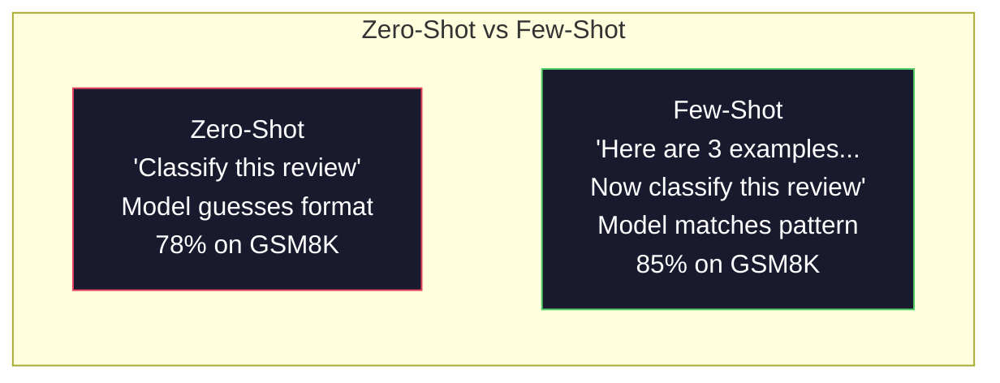
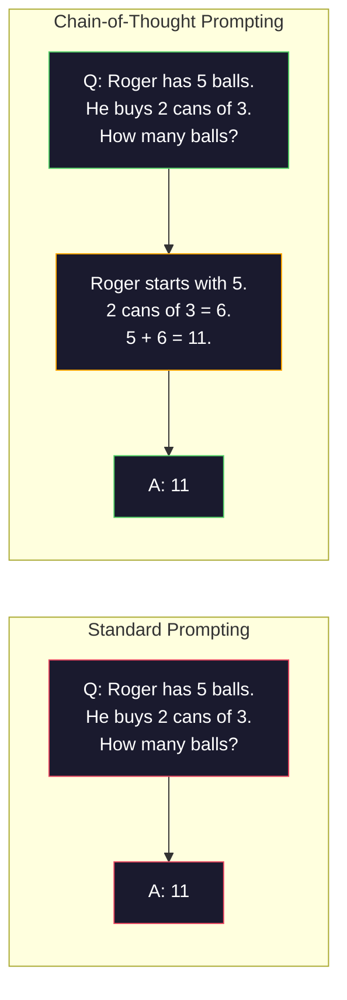
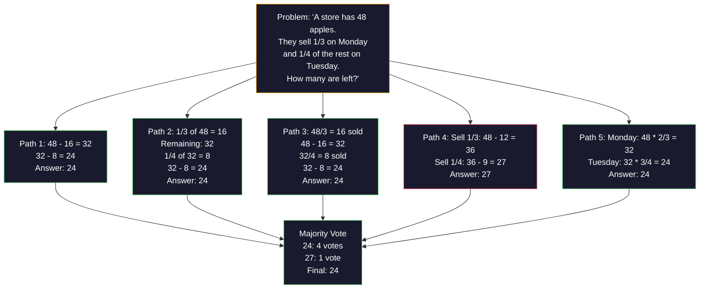
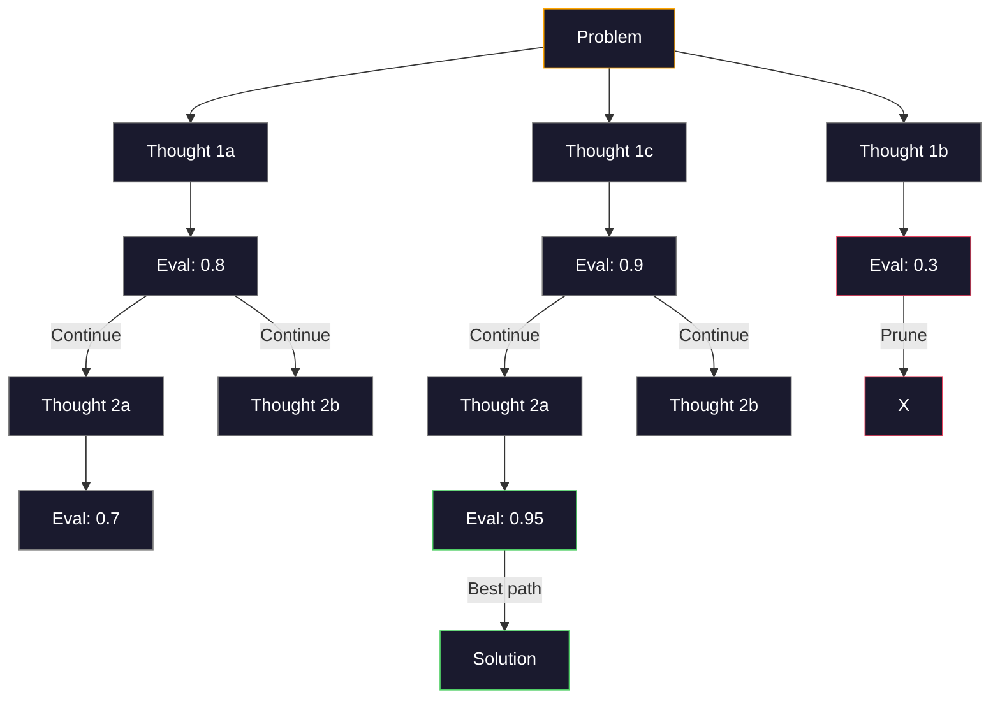
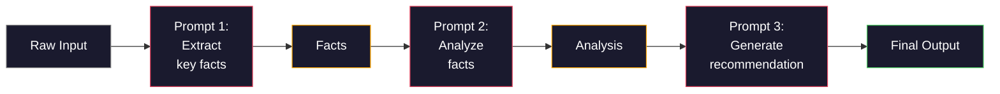

# 少样本、思维链、思维树

> 告诉模型要做什么是提示。向它展示如何思考是工程。在同一个模型、同一个任务、同一个数据上，从78%到91%的准确率差距，并不是因为更好的模型，而是因为更好的推理策略。

**类型：** 构建
**语言：** Python
**前置条件：** 课程 11.01（提示工程）
**预计用时：** ~45分钟

## 学习目标

- 通过选择和格式化能最大化任务准确率的示例演示，实现少样本提示
- 应用思维链（CoT）推理来提升多步问题（如数学应用题）的准确率
- 构建思维树提示，探索多条推理路径并选择最佳路径
- 在标准基准上衡量零样本 vs 少样本 vs 思维链带来的准确率提升

## 问题

你构建了一个数学辅导应用。你的提示是："解决这道应用题。"GPT-5 在 GSM8K（标准的小学数学基准）上达到了94%的正确率。你以为你已经达到了顶峰。但你没有——思维链仍然能增加3-4个百分点。

只需加上五个词——"让我们一步一步地思考"——准确率就跃升至91%。再加几个已解决的示例，准确率就达到95%。同样的模型。同样的温度。同样的API成本。唯一的区别是你给了模型一张草稿纸。

这并非噱头。这便是推理的运作方式。人类并非通过一次心智跳跃来解决多步问题。Transformer 也是如此。当你强制模型生成中间token时，这些token会成为下一个token的上下文。每一步推理都喂养下一步。模型实际上是逐步计算到答案的。

但"一步步思考"只是起点，而非终点。如果你采样五条推理路径并取多数投票呢？如果你让模型探索一个可能性树，评估并剪枝呢？如果你将推理与工具使用交错进行呢？这些都不是假设。它们是已发表的技术，具有可测量的改进，你将在本课程中构建所有它们。

## 概念

### 零样本 vs 少样本：何时示例胜过指令

零样本提示只给模型一个任务，别无其他。少样本提示则先给出示例。

Wei 等人（2022年）在8个基准上对此进行了测量。对于简单任务如情感分类，零样本和少样本的准确率相差在2%以内。对于复杂任务如多步算术和符号推理，少样本将准确率提高了10-25%。

直觉：示例是压缩的指令。与其描述输出格式，不如展示它。与其解释推理过程，不如演示它。模型在示例上进行模式匹配，比解释抽象指令更可靠。



**少样本胜出的场景：** 格式敏感任务、分类、结构化提取、领域特定术语、任何需要模型匹配特定模式的任务。

**零样本胜出的场景：** 简单事实性问题、创造性任务（示例会束缚创造力）、寻找好示例比写好指令更困难的任务。

### 示例选择：相似优于随机

并非所有示例都同等重要。选择与目标输入相似的示例，在分类任务上比随机选择高出5-15%（Liu et al., 2022）。三个原则：

1. **语义相似性**：选择在嵌入空间中离输入最近的示例
2. **标签多样性**：示例中覆盖所有输出类别
3. **难度匹配**：匹配目标问题的复杂度水平

大多数任务的最佳示例数量是3-5个。少于3个，模型没有足够的信号来提取模式。超过5个，收益递减并浪费上下文窗口token。对于多标签分类，每个标签用一个示例。

### 思维链：给模型草稿纸

思维链（CoT）提示由 Google Brain 的 Wei 等人（2022年）提出。思路很简单：不要求模型直接给出答案，而是要求它先展示推理步骤。



这为什么在机制上有效？Transformer 生成的每个token都会成为下一个token的上下文。没有CoT，模型必须将所有推理压缩到单次前向传播的隐藏状态中。有了CoT，模型将中间计算外部化为token。每个推理token扩展了有效计算深度。

**GSM8K基准（小学数学，8500个问题）：**

| 模型 | 零样本 | 零样本CoT | 少样本CoT |
|-------|-----------|---------------|--------------|
| GPT-4o | 78% | 91% | 95% |
| GPT-5 | 94% | 97% | 98% |
| o4-mini（推理模型） | 97% | — | — |
| Claude Opus 4.7 | 93% | 97% | 98% |
| Gemini 3 Pro | 92% | 96% | 98% |
| Llama 4 70B | 80% | 89% | 94% |
| DeepSeek-V3.1 | 89% | 94% | 96% |

**关于推理模型的说明。** 像 OpenAI 的 o 系列（o3、o4-mini）和 DeepSeek-R1 这样的模型会在内部运行思维链，然后才发出答案。向推理模型添加"让我们一步步思考"是多余的，有时甚至适得其反——它们已经做过这件事了。

CoT的两种风格：

**零样本CoT**：在提示后追加"让我们一步步思考"。无需示例。Kojima et al.（2022）表明，这一句话就能提升算术、常识和符号推理任务的准确率。

**少样本CoT**：提供包含推理步骤的示例。比零样本CoT更有效，因为模型看到了你期望的确切推理格式。

**CoT何时有害：** 简单事实回忆（"法国的首都是什么？"）、单步分类、速度比准确率更重要的任务。CoT每次查询会增加50-200个token的推理开销。对于高吞吐、低复杂度的任务，这是浪费成本。

### 自洽性：多次采样，一次投票

Wang et al.（2023）引入了自洽性。其洞察是：一个单一的CoT路径可能包含推理错误。但如果你采样N个独立推理路径（使用温度>0），并在最终答案上取多数投票，错误就会相互抵消。



在最初的PaLM 540B实验中，自洽性将GSM8K准确率从56.5%（单次CoT）提升到74.4%（N=40）。在GPT-5上改进较小（97%到98%），因为基础准确率已经饱和。该技术最适用于基础CoT准确率在60-85%的模型——这是单路径错误频繁但并非系统性的甜区。对于推理模型（o系列、R1），自洽性已被内置的内部采样所包含。

权衡：N个样本意味着N倍的API成本和延迟。实践中，N=5就能捕获大部分收益。N=3是获得有意义投票的最低值。对于大多数任务，N>10的收益递减。

### 思维树：分支探索

Yao et al.（2023）引入了思维树（ToT）。CoT遵循一条线性推理路径，而ToT则探索多个分支，在继续之前评估哪些分支最有希望。



ToT有三个组件：

1. **想法生成**：生成多个候选下一步
2. **状态评估**：对每个候选进行评分（可以使用LLM本身作为评估器）
3. **搜索算法**：在树中执行广度优先搜索或深度优先搜索，剪掉低分分支

在Game of 24任务（用四个数字通过算术运算得到24）中，GPT-4使用标准提示解决了7.3%的问题。使用CoT为4.0%（CoT在这里实际有害，因为搜索空间很大）。使用ToT为74%。

ToT成本高昂。树中的每个节点都需要一次LLM调用。分支因子为3、深度为3的树最多需要39次LLM调用。仅当问题搜索空间大但可评估时才使用它——规划、谜题求解、有约束的创造性问题求解。

### ReAct：思考+行动

Yao et al.（2022）将推理轨迹与行动结合起来。模型在思考（生成推理）和行动（调用工具、搜索、计算）之间交替。

```mermaid
graph LR
    Q["Question:\nWhat is the\npopulation of the\ncountry where\nthe Eiffel Tower\nis located?"]
    T1["Thought: I need to\nfind which country\nhas the Eiffel Tower"]
    A1["Action: search\n'Eiffel Tower location'"]
    O1["Observation:\nParis, France"]
    T2["Thought: Now I need\nFrance's population"]
    A2["Action: search\n'France population 2024'"]
    O2["Observation:\n68.4 million"]
    T3["Thought: I have\nthe answer"]
    F["Answer:\n68.4 million"]

    Q --> T1 --> A1 --> O1 --> T2 --> A2 --> O2 --> T3 --> F

    style Q fill:#1a1a2e,stroke:#ffa500,color:#fff
    style T1 fill:#1a1a2e,stroke:#51cf66,color:#fff
    style A1 fill:#1a1a2e,stroke:#e94560,color:#fff
    style O1 fill:#1a1a2e,stroke:#808080,color:#fff
    style T2 fill:#1a1a2e,stroke:#51cf66,color:#fff
    style A2 fill:#1a1a2e,stroke:#e94560,color:#fff
    style O2 fill:#1a1a2e,stroke:#808080,color:#fff
    style T3 fill:#1a1a2e,stroke:#51cf66,color:#fff
    style F fill:#1a1a2e,stroke:#51cf66,color:#fff
```



ReAct在知识密集型任务上优于纯CoT，因为它能将推理建立在真实数据之上。在HotpotQA（多跳问答）上，使用GPT-4的ReAct达到35.1%的精确匹配，而单独使用CoT为29.4%。真正的力量在于推理错误可以通过观察得到纠正——模型可以在执行过程中更新其计划。

ReAct是现代AI智能体的基础。每个智能体框架（LangChain、CrewAI、AutoGen）都实现了思维-行动-观察循环的某种变体。你将在阶段14中构建完整智能体。本课程涵盖提示模式。

### 结构化提示：XML标签、分隔符、标题

随着提示变得复杂，结构可以防止模型混淆各个部分。三种方法：

**XML标签**（在Claude上效果最好，其他模型也不错）：
```
<context>
You are reviewing a pull request.
The codebase uses TypeScript and React.
</context>

<task>
Review the following diff for bugs, security issues, and style violations.
</task>

<diff>
{diff_content}
</diff>

<output_format>
List each issue with: file, line, severity (critical/warning/info), description.
</output_format>
```

**Markdown标题**（通用）：
```
## Role
Senior security engineer at a fintech company.

## Task
Analyze this API endpoint for vulnerabilities.

## Input
{api_code}

## Rules
- Focus on OWASP Top 10
- Rate each finding: critical, high, medium, low
- Include remediation steps
```

**分隔符**（简单但有效）：
```
---INPUT---
{user_text}
---END INPUT---

---INSTRUCTIONS---
Summarize the above in 3 bullet points.
---END INSTRUCTIONS---
```

### 提示链：顺序分解

有些任务对单个提示来说过于复杂。提示链将它们分解为多个步骤，其中一个提示的输出成为下一个提示的输入。



链式提示比单提示更好的三个原因：

1. **每个步骤更简单**：模型处理单一聚焦任务，而不是同时处理所有事情
2. **中间输出可检查**：你可以在步骤之间验证和纠正
3. **不同步骤可以使用不同模型**：用廉价模型进行提取，用昂贵模型进行推理

### 性能对比

| 技术 | 最适合 | GSM8K准确率（GPT-5） | API调用次数 | 令牌开销 | 复杂度 |
|-----------|----------|------------------------|-----------|----------------|------------|
| 零样本 | 简单任务 | 94% | 1 | 无 | 简单 |
| 少样本 | 格式匹配 | 96% | 1 | 200-500 tokens | 低 |
| 零样本CoT | 快速推理提升 | 97% | 1 | 50-200 tokens | 简单 |
| 少样本CoT | 单次调用最高准确率 | 98% | 1 | 300-600 tokens | 低 |
| 自洽性（N=5） | 高风险推理 | 98.5% | 5 | 5倍令牌成本 | 中 |
| 推理模型（o4-mini） | 即插即用CoT替代 | 97% | 1 | 隐藏（2-10倍内部开销） | 简单 |
| 思维树 | 搜索/规划问题 | N/A（Game of 24上74%） | 10-40+ | 10-40倍令牌成本 | 高 |
| ReAct | 知识基础推理 | N/A（HotpotQA上35.1%） | 3-10+ | 可变 | 高 |
| 提示链 | 复杂多步任务 | 96%（流水线） | 2-5 | 2-5倍令牌成本 | 中 |

正确的技术取决于三个因素：准确率要求、延迟预算和成本容忍度。对于大多数生产系统，少样本CoT配合3样本自洽性备用方案覆盖了90%的使用场景。

## 构建

我们将构建一个数学问题求解器，它将少样本提示、思维链推理和自洽性投票结合成一个流水线。然后我们将为困难问题添加思维树。

完整实现在 `code/advanced_prompting.py` 中。以下是关键组件。

### 第1步：少样本示例存储

第一个组件管理少样本示例，并为给定问题选择最相关的示例。

```python
GSM8K_EXAMPLES = [
    {
        "question": "Janet's ducks lay 16 eggs per day. She eats three for breakfast every morning and bakes muffins for her friends every day with four. She sells every egg at the farmers' market for $2. How much does she make every day at the farmers' market?",
        "reasoning": "Janet's ducks lay 16 eggs per day. She eats 3 and bakes 4, using 3 + 4 = 7 eggs. So she has 16 - 7 = 9 eggs left. She sells each for $2, so she makes 9 * 2 = $18 per day.",
        "answer": "18"
    },
    ...
]
```

每个示例包含三个部分：问题、推理链和最终答案。推理链是将常规少样本示例转换为CoT少样本示例的关键。

### 第2步：思维链提示构建器

提示构建器将系统消息、带有推理链的少样本示例以及目标问题组装成一个提示。

```python
def build_cot_prompt(question, examples, num_examples=3):
    system = (
        "You are a math problem solver. "
        "For each problem, show your step-by-step reasoning, "
        "then give the final numerical answer on the last line "
        "in the format: 'The answer is [number]'."
    )

    example_text = ""
    for ex in examples[:num_examples]:
        example_text += f"Q: {ex['question']}\n"
        example_text += f"A: {ex['reasoning']} The answer is {ex['answer']}.\n\n"

    user = f"{example_text}Q: {question}\nA:"
    return system, user
```

格式约束（"答案是[数字]"）至关重要。没有它，自洽性就无法跨样本提取和比较答案。

### 第3步：自洽性投票

采样N条推理路径并取多数答案。

```python
def self_consistency_solve(question, examples, client, model, n_samples=5):
    system, user = build_cot_prompt(question, examples)

    answers = []
    reasonings = []
    for _ in range(n_samples):
        response = client.chat.completions.create(
            model=model,
            messages=[
                {"role": "system", "content": system},
                {"role": "user", "content": user}
            ],
            temperature=0.7
        )
        text = response.choices[0].message.content
        reasonings.append(text)
        answer = extract_answer(text)
        if answer is not None:
            answers.append(answer)

    vote_counts = Counter(answers)
    best_answer = vote_counts.most_common(1)[0][0] if vote_counts else None
    confidence = vote_counts[best_answer] / len(answers) if best_answer else 0

    return best_answer, confidence, reasonings, vote_counts
```

温度0.7很重要。温度为0.0时，所有N个样本将是相同的，这违背了目的。你需要足够的随机性来实现多样化的推理路径，但又不能太多以至于模型产生胡言乱语。

### 第4步：思维树求解器

对于线性推理失败的问题，ToT探索多种方法并评估哪个方向最有希望。

```python
def tree_of_thought_solve(question, client, model, breadth=3, depth=3):
    thoughts = generate_initial_thoughts(question, client, model, breadth)
    scored = [(t, evaluate_thought(t, question, client, model)) for t in thoughts]
    scored.sort(key=lambda x: x[1], reverse=True)

    for current_depth in range(1, depth):
        next_thoughts = []
        for thought, score in scored[:2]:
            extensions = extend_thought(thought, question, client, model, breadth)
            for ext in extensions:
                ext_score = evaluate_thought(ext, question, client, model)
                next_thoughts.append((ext, ext_score))
        scored = sorted(next_thoughts, key=lambda x: x[1], reverse=True)

    best_thought = scored[0][0] if scored else ""
    return extract_answer(best_thought), best_thought
```

评估器本身也是一次LLM调用。你让模型："在0.0到1.0的尺度上，这个推理路径对解决问题有多大希望？"这是ToT的关键洞察——模型评估自己的部分解决方案。

### 第5步：完整流水线

该流水线将所有技术结合起来，并采用升级策略。

```python
def solve_with_escalation(question, examples, client, model):
    system, user = build_cot_prompt(question, examples)
    single_response = call_llm(client, model, system, user, temperature=0.0)
    single_answer = extract_answer(single_response)

    sc_answer, confidence, _, _ = self_consistency_solve(
        question, examples, client, model, n_samples=5
    )

    if confidence >= 0.8:
        return sc_answer, "self_consistency", confidence

    tot_answer, _ = tree_of_thought_solve(question, client, model)
    return tot_answer, "tree_of_thought", None
```

升级逻辑：先尝试廉价的方法（单次CoT）。如果自洽性置信度低于0.8（5个样本中少于4个一致），则升级到ToT。这平衡了成本和准确率——大多数问题被廉价地解决，困难问题获得更多计算量。

## 使用

### 与LangChain一起使用

LangChain为提示模板和输出解析提供了内置支持，简化了少样本和CoT模式：

```python
from langchain_core.prompts import FewShotPromptTemplate, PromptTemplate
from langchain_openai import ChatOpenAI

example_prompt = PromptTemplate(
    input_variables=["question", "reasoning", "answer"],
    template="Q: {question}\nA: {reasoning} The answer is {answer}."
)

few_shot_prompt = FewShotPromptTemplate(
    examples=examples,
    example_prompt=example_prompt,
    suffix="Q: {input}\nA: Let's think step by step.",
    input_variables=["input"]
)

llm = ChatOpenAI(model="gpt-4o", temperature=0.7)
chain = few_shot_prompt | llm
result = chain.invoke({"input": "If a train travels 120 km in 2 hours..."})
```

LangChain还有用于语义相似性选择的 `ExampleSelector` 类：

```python
from langchain_core.example_selectors import SemanticSimilarityExampleSelector
from langchain_openai import OpenAIEmbeddings

selector = SemanticSimilarityExampleSelector.from_examples(
    examples,
    OpenAIEmbeddings(),
    k=3
)
```

### 与DSPy一起使用

DSPy将提示策略视为可优化的模块。无需手工制作CoT提示，你定义一个签名，让DSPy优化提示：

```python
import dspy

dspy.configure(lm=dspy.LM("openai/gpt-4o", temperature=0.7))

class MathSolver(dspy.Module):
    def __init__(self):
        self.solve = dspy.ChainOfThought("question -> answer")

    def forward(self, question):
        return self.solve(question=question)

solver = MathSolver()
result = solver(question="Janet's ducks lay 16 eggs per day...")
```

DSPy的 `ChainOfThought` 自动添加推理轨迹。`dspy.majority` 实现自洽性：

```python
result = dspy.majority(
    [solver(question=q) for _ in range(5)],
    field="answer"
)
```

### 对比：从头构建 vs 框架

| 特性 | 从头构建（本课程） | LangChain | DSPy |
|---------|--------------------------|-----------|------|
| 对提示格式的控制 | 完全 | 基于模板 | 自动 |
| 自洽性 | 手动投票 | 手动 | 内置（`dspy.majority`） |
| 示例选择 | 自定义逻辑 | `ExampleSelector` | `dspy.BootstrapFewShot` |
| 思维树 | 自定义树搜索 | 社区链 | 未内置 |
| 提示优化 | 手动迭代 | 手动 | 自动编译 |
| 最适合 | 学习、自定义流水线 | 标准工作流 | 研究、优化 |

## 交付

本课程产生两个交付物。

**1. 推理链提示**（`outputs/prompt-reasoning-chain.md`）：一个生产就绪的提示模板，用于少样本CoT配合自洽性。放入你的示例和问题领域。

**2. CoT模式选择技能**（`outputs/skill-cot-patterns.md`）：一个决策框架，用于根据任务类型、准确率要求和成本约束选择正确的推理技术。

## 练习

1. **测量差距**：取10个GSM8K问题。分别用零样本、少样本、零样本CoT和少样本CoT求解。记录每种方法的准确率。哪种技术在您的模型上提升最大？

2. **示例选择实验**：对于相同的10个问题，比较随机选择示例与手工挑选相似示例。测量准确率差异。在什么情况下，示例质量比示例数量更重要？

3. **自洽性成本曲线**：在20个GSM8K问题上运行自洽性，N=1, 3, 5, 7, 10。绘制准确率与成本（总令牌数）的关系。对于您的模型，曲线的拐点在哪里？

4. **构建一个ReAct循环**：向流水线添加一个计算器工具。当模型生成数学表达式时，用Python的 `eval()`（在沙箱中）执行它，并将结果反馈回去。测量基于工具的推理是否优于纯CoT。

5. **用于创造性任务的ToT**：将思维树求解器适配到一个创意写作任务："写一个既有趣又悲伤的6词故事。"使用LLM作为评估器。分支探索是否比单次生成能产生更好的创意输出？

## 关键术语

| 术语 | 人们通常说的 | 实际含义 |
|------|----------------|----------------------|
| 少样本提示 | "给一些示例" | 在提示中包含输入-输出示例，以锚定模型的输出格式和行为 |
| 思维链 | "让它一步步思考" | 引出中间推理token，扩展模型在生成最终答案前的有效计算 |
| 自洽性 | "运行多次" | 在温度>0下采样N条不同的推理路径，并通过多数投票选择最常见的最终答案 |
| 思维树 | "让它探索选项" | 对推理分支进行结构化搜索，每个部分解决方案都被评估，只有有希望的路径才会被扩展 |
| ReAct | "思考+工具使用" | 在思维-行动-观察循环中交错推理轨迹与外部行动（搜索、计算、API调用） |
| 提示链 | "分解为步骤" | 将复杂任务分解为顺序提示，每个输出馈入下一个输入 |
| 零样本CoT | "只需加上'一步步思考'" | 在没有任何示例的提示中追加推理触发短语，依赖模型潜在的推理能力 |

## 进一步阅读

- [Chain-of-Thought Prompting Elicits Reasoning in Large Language Models](https://arxiv.org/abs/2201.11903) -- Wei et al. 2022. 来自Google Brain的原始CoT论文。阅读第2-3节以获取核心结果。
- [Self-Consistency Improves Chain of Thought Reasoning in Language Models](https://arxiv.org/abs/2203.11171) -- Wang et al. 2023. 自洽性论文。表1包含了您需要的所有数据。
- [Tree of Thoughts: Deliberate Problem Solving with Large Language Models](https://arxiv.org/abs/2305.10601) -- Yao et al. 2023. ToT论文。第4节中的Game of 24结果是亮点。
- [ReAct: Synergizing Reasoning and Acting in Language Models](https://arxiv.org/abs/2210.03629) -- Yao et al. 2022. 现代AI智能体的基础。第3节解释了思维-行动-观察循环。
- [Large Language Models are Zero-Shot Reasoners](https://arxiv.org/abs/2205.11916) -- Kojima et al. 2022. "让我们一步步思考"论文。对于如此简单的方法，效果惊人。
- [DSPy: Compiling Declarative Language Model Calls into Self-Improving Pipelines](https://arxiv.org/abs/2310.03714) -- Khattab et al. 2023. 将提示视为编译问题。如果您想超越手动提示工程，请阅读。
- [OpenAI — Reasoning models guide](https://platform.openai.com/docs/guides/reasoning) -- 供应商指南，说明思维链何时成为内部、按token计费的"推理"模式，而非提示层面的技巧。
- [Lightman et al., "Let's Verify Step by Step" (2023)](https://arxiv.org/abs/2305.20050) -- 过程奖励模型（PRM），对链中的每一步进行评分；这种推理监督信号优于仅基于结果的奖励。
- [Snell et al., "Scaling LLM Test-Time Compute Optimally" (2024)](https://arxiv.org/abs/2408.03314) -- 对CoT长度、自洽性采样和MCTS的系统研究；当准确率比延迟更重要时，"一步步思考"走向何方。
