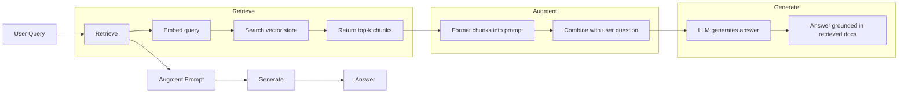
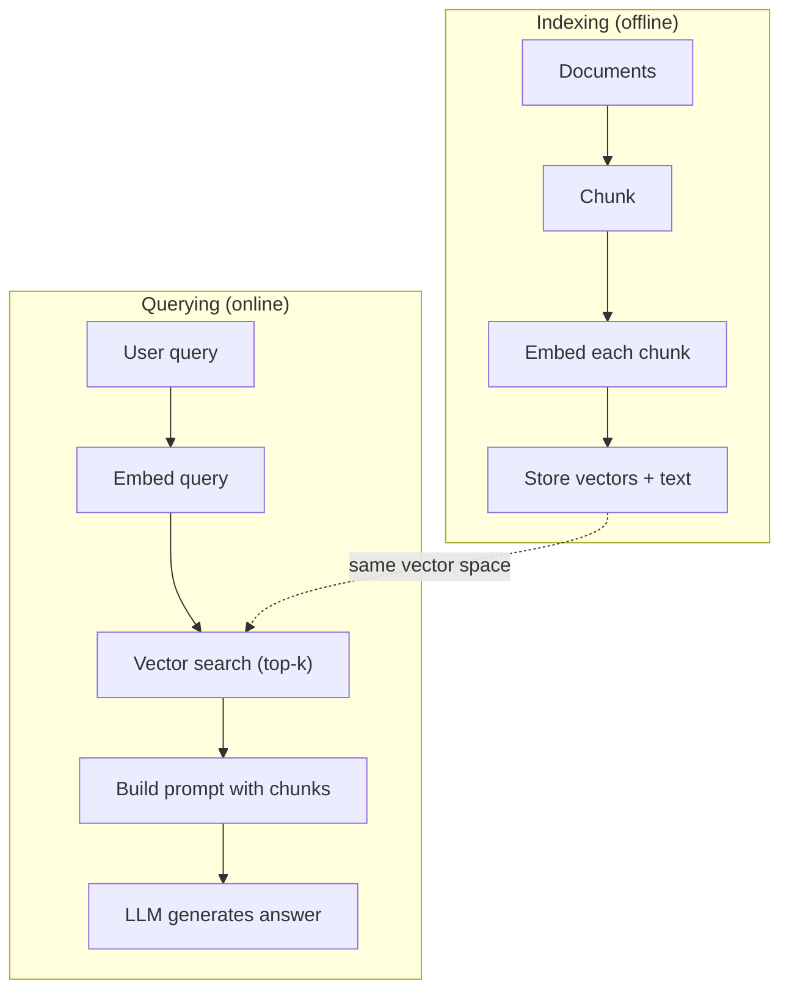

# RAG（检索增强生成）

> 你的大语言模型知道截止训练截止日的一切。但它对你公司的文档、代码库或上周的会议记录一无所知。RAG 通过检索相关文档并将其塞入提示词中来解决这个问题。它是生产级 AI 中部署最多的模式。如果你要从本课程中学到一样东西，那就构建一个 RAG 流水线。

**类型：** 动手搭建  
**语言：** Python  
**前置条件：** 阶段 10（从零实现大语言模型），阶段 11 课程 01-05  
**时长：** ~90 分钟  
**相关：** 阶段 5 · 23（RAG 的分块策略）详细讲解六种分块算法及其适用场景。阶段 5 · 22（嵌入模型深度解析）帮助你选择合适的嵌入器。阶段 11 · 07（高级 RAG）介绍混合搜索、重排序和查询转换。

## 学习目标

- 构建一个完整的 RAG 流水线：文档加载、分块、嵌入、向量存储、检索和生成
- 使用向量数据库（ChromaDB、FAISS 或 Pinecone）及合适的索引实现语义搜索
- 解释为什么对于知识接地型应用，RAG 优于微调（成本、新鲜度、可溯源）
- 使用检索指标（精确率、召回率）和生成指标（忠实度、相关性）评估 RAG 质量

## 问题

你为公司构建了一个聊天机器人。客户问道：“企业版的退款政策是什么？”大语言模型给出了关于典型 SaaS 退款政策的通用回答。而实际政策（藏在 200 页的内部 wiki 中）规定企业客户享有 60 天的按比例退款窗口。该大语言模型从未见过这份文档。它无法知道它未曾训练过的内容。

微调是一种解决方案。拿大语言模型，在你的内部文档上训练它，然后部署更新后的模型。这可行，但有严重问题。微调需要花费数千美元的算力。一旦文档发生变化，模型立刻变得过时。你无法知道模型从哪个来源获取信息。而且如果公司下个月收购了另一条产品线，你需要再次微调。

RAG 是另一种解决方案。保持模型不变。当有提问时，在你的文档库中搜索相关段落，在提问前将它们粘贴到提示词中，然后让模型利用这些段落作为上下文来回答。文档库可以在几分钟内更新。你可以清楚地看到检索到了哪些文档。模型本身从未改变。这就是为什么 RAG 是生产环境中的主导模式：更便宜、更新鲜、更可审计，并且兼容任何大语言模型。

## 概念

### RAG 模式

整个模式分为四步：



查询 -> 检索 -> 增强提示 -> 生成。每个 RAG 系统都遵循此模式。生产级 RAG 系统之间的差异在于每一步的细节：如何分块、如何嵌入、如何搜索、如何构建提示。

### 为什么 RAG 优于微调

| 关注点 | 微调 | RAG |
|--------|------|-----|
| 成本 | 每次训练 $1,000-$100,000+ | 每次查询 $0.01-$0.10（嵌入 + 大语言模型） |
| 新鲜度 | 过时直到重新训练 | 通过重新索引文档，几分钟内更新 |
| 可审计性 | 无法追踪答案来源 | 可展示确切的检索段落 |
| 幻觉 | 仍然自由地产生幻觉 | 基于检索到的文档接地 |
| 数据隐私 | 训练数据嵌入权重中 | 文档保留在你的向量存储中 |

微调会永久改变模型的权重。RAG 临时改变模型的上下文。对于大多数应用，临时上下文正是你需要的。

微调胜出的唯一情况：当你需要模型采用特定的风格、语调或推理模式，而这些无法仅通过提示词实现时。对于事实性知识检索，RAG 每次都能胜出。

### 嵌入模型

嵌入模型将文本转换为稠密向量。相似的文本在高维空间中产生相近的向量。“如何重置我的密码？”和“我需要更改我的密码”尽管用词不同，但向量几乎相同。“猫坐在垫子上”产生的向量则截然不同。

常见嵌入模型（2026 年阵容——详细分析见阶段 5 · 22）：

| 模型 | 维度 | 提供商 | 说明 |
|-------|-------|----------|-------|
| text-embedding-3-small | 1536（Matryoshka） | OpenAI | 大多数用例的最佳性价比 |
| text-embedding-3-large | 3072（Matryoshka） | OpenAI | 更高精度，可截断至 256/512/1024 |
| Gemini Embedding 2 | 3072（Matryoshka） | Google | MTEB 检索排名靠前；8K 上下文 |
| voyage-4 | 1024/2048（Matryoshka） | Voyage AI | 领域变体（代码、金融、法律）|
| Cohere embed-v4 | 1024（Matryoshka） | Cohere | 强大的多语言能力，128K 上下文 |
| BGE-M3 | 1024（稠密 + 稀疏 + ColBERT） | BAAI（开放权重）| 一个模型三种视图 |
| Qwen3-Embedding | 4096（Matryoshka） | 阿里巴巴（开放权重）| 开放权重检索分数最高 |
| all-MiniLM-L6-v2 | 384 | 开放权重（Sentence Transformers）| 原型基准 |

在本课中，我们使用 TF-IDF 构建自己的简单嵌入。不是因为 TF-IDF 是生产系统的选择，而是因为它让概念具体化：文本输入，向量输出，相似文本产生相似向量。

### 向量相似度

给定两个向量，如何衡量相似度？三种选择：

**余弦相似度**：两个向量夹角的余弦。范围从 -1（相反）到 1（完全相同）。忽略幅度，只关心方向。这是 RAG 的默认选择。

```
cosine_sim(a, b) = dot(a, b) / (||a|| * ||b||)
```

**点积**：原始内积。较大的向量获得更高分数。当幅度携带信息（更长的文档可能更相关）时有用。

```
dot(a, b) = sum(a_i * b_i)
```

**L2（欧几里得）距离**：向量空间中的直线距离。距离越小 = 越相似。对幅度差异敏感。

```
L2(a, b) = sqrt(sum((a_i - b_i)^2))
```

余弦相似度是标准。它能优雅地处理长度不同的文档，因为会按幅度归一化。当人们说“向量搜索”时，几乎总是指余弦相似度。

### 分块策略

文档太长，不能作为单个向量嵌入。一份 50 页的 PDF 可能包含几十个主题，产生糟糕的嵌入。因此，你将文档分割成块，并分别嵌入每个块。

**固定大小分块**：每 N 个 token 分割一次。简单且可预测。一个 512 token 的块，重叠 50 token，意味着块 1 是 token 0-511，块 2 是 token 462-973，以此类推。重叠确保不会在不幸的边界处切开一个句子。

**语义分块**：在自然边界处分割。段落、章节或 Markdown 标题。每个块是一个连贯的意义单元。实现更复杂，但能带来更好的检索。

**递归分块**：先在最大边界处（章节标题）尝试分割。如果章节仍然太大，在段落边界处分割。如果段落仍然太大，在句子边界处分割。这是 LangChain 的 RecursiveCharacterTextSplitter 方法，在实践中表现良好。

块大小比人们想象的重要得多：

- 太小（64-128 token）：每个块缺少上下文。“它上季度增长了 15%” 不知道“它”指什么就没有意义。
- 太大（2048+ token）：每个块涵盖多个主题，稀释了相关性。当你搜索营收数据时，得到的块 10% 关于营收，90% 关于员工人数。
- 最佳点（256-512 token）：有足够的上下文保持独立，又聚焦到足以相关。

大多数生产级 RAG 系统使用 256-512 token 的块，重叠 50 token。Anthropic 的 RAG 指南推荐这个范围。

### 向量数据库

一旦有了嵌入，就需要存储和搜索它们。选项如下：

| 数据库 | 类型 | 最适合 |
|--------|------|----------|
| FAISS | 库（进程内）| 原型开发，中小型数据集 |
| Chroma | 轻量级数据库 | 本地开发，小型部署 |
| Pinecone | 托管的服务 | 生产环境，无需运维开销 |
| Weaviate | 开源数据库 | 自托管生产环境 |
| pgvector | Postgres 扩展 | 已在使用 Postgres |
| Qdrant | 开源数据库 | 高性能自托管 |

本课中，我们构建一个简单的内存向量存储。它将向量存储在列表中，并执行暴力余弦相似度搜索。这等效于带平面索引的 FAISS。它可能扩展到约 100,000 个向量才变慢。生产系统使用近似最近邻（ANN）算法（如 HNSW）在几毫秒内搜索数百万个向量。

### 完整流水线



索引阶段在每个文档（或文档更新时）运行一次。查询阶段在每个用户请求时运行。生产中，索引可能需要数小时处理数百万个文档。查询必须在不到一秒内响应。

### 真实数字

大多数生产 RAG 系统使用以下参数：

- **k = 每次查询检索 5 到 10 个块**
- **块大小 = 256 到 512 token**，重叠 50 token
- **上下文预算**：每次查询检索到的内容占 2,500-5,000 token
- **总提示词**：~8,000-16,000 token（系统提示 + 检索到的块 + 对话历史 + 用户查询）
- **嵌入维度**：384-3072，取决于模型
- **索引吞吐量**：使用 API 嵌入时每秒 100-1,000 个文档
- **查询延迟**：检索 50-200ms，生成 500-3000ms

## 动手搭建

### 步骤 1：文档分块

```python
def chunk_text(text, chunk_size=200, overlap=50):
    words = text.split()
    chunks = []
    start = 0
    while start < len(words):
        end = start + chunk_size
        chunk = " ".join(words[start:end])
        chunks.append(chunk)
        start += chunk_size - overlap
    return chunks
```

### 步骤 2：TF-IDF 嵌入

我们构建一个简单的嵌入函数。TF-IDF（词频-逆文档频率）不是神经嵌入，但它以捕捉词重要性的方式将文本转换为向量。文档中频繁出现的词 TF 较高。整个语料库中罕见的词 IDF 较高。乘积得到一个向量，其中重要、独特的词具有高值。

```python
import math
from collections import Counter

def build_vocabulary(documents):
    vocab = set()
    for doc in documents:
        vocab.update(doc.lower().split())
    return sorted(vocab)

def compute_tf(text, vocab):
    words = text.lower().split()
    count = Counter(words)
    total = len(words)
    return [count.get(word, 0) / total for word in vocab]

def compute_idf(documents, vocab):
    n = len(documents)
    idf = []
    for word in vocab:
        doc_count = sum(1 for doc in documents if word in doc.lower().split())
        idf.append(math.log((n + 1) / (doc_count + 1)) + 1)
    return idf

def tfidf_embed(text, vocab, idf):
    tf = compute_tf(text, vocab)
    return [t * i for t, i in zip(tf, idf)]
```

### 步骤 3：余弦相似度搜索

```python
def cosine_similarity(a, b):
    dot = sum(x * y for x, y in zip(a, b))
    norm_a = math.sqrt(sum(x * x for x in a))
    norm_b = math.sqrt(sum(x * x for x in b))
    if norm_a == 0 or norm_b == 0:
        return 0.0
    return dot / (norm_a * norm_b)

def search(query_embedding, stored_embeddings, top_k=5):
    scores = []
    for i, emb in enumerate(stored_embeddings):
        sim = cosine_similarity(query_embedding, emb)
        scores.append((i, sim))
    scores.sort(key=lambda x: x[1], reverse=True)
    return scores[:top_k]
```

### 步骤 4：提示词构建

这就是 RAG 中“增强”发生的地方。取检索到的块，格式化为提示词，并要求大语言模型根据提供的上下文进行回答。

```python
def build_rag_prompt(query, retrieved_chunks):
    context = "\n\n---\n\n".join(
        f"[Source {i+1}]\n{chunk}"
        for i, chunk in enumerate(retrieved_chunks)
    )
    return f"""Answer the question based ONLY on the following context.
If the context doesn't contain enough information, say "I don't have enough information to answer that."

Context:
{context}

Question: {query}

Answer:"""
```

### 步骤 5：完整的 RAG 流水线

```python
class RAGPipeline:
    def __init__(self):
        self.chunks = []
        self.embeddings = []
        self.vocab = []
        self.idf = []

    def index(self, documents):
        all_chunks = []
        for doc in documents:
            all_chunks.extend(chunk_text(doc))
        self.chunks = all_chunks
        self.vocab = build_vocabulary(all_chunks)
        self.idf = compute_idf(all_chunks, self.vocab)
        self.embeddings = [
            tfidf_embed(chunk, self.vocab, self.idf)
            for chunk in all_chunks
        ]

    def query(self, question, top_k=5):
        query_emb = tfidf_embed(question, self.vocab, self.idf)
        results = search(query_emb, self.embeddings, top_k)
        retrieved = [(self.chunks[i], score) for i, score in results]
        prompt = build_rag_prompt(
            question, [chunk for chunk, _ in retrieved]
        )
        return prompt, retrieved
```

### 步骤 6：生成（模拟）

在生产中，这里会调用大语言模型 API。本课中，我们通过从检索到的上下文中提取最相关的句子来模拟生成。

```python
def simple_generate(prompt, retrieved_chunks):
    query_words = set(prompt.lower().split("question:")[-1].split())
    best_sentence = ""
    best_score = 0
    for chunk in retrieved_chunks:
        for sentence in chunk.split("."):
            sentence = sentence.strip()
            if not sentence:
                continue
            words = set(sentence.lower().split())
            overlap = len(query_words & words)
            if overlap > best_score:
                best_score = overlap
                best_sentence = sentence
    return best_sentence if best_sentence else "I don't have enough information."
```

## 使用它

使用真正的嵌入模型和大语言模型时，代码几乎不变：

```python
from openai import OpenAI

client = OpenAI()

def embed(text):
    response = client.embeddings.create(
        model="text-embedding-3-small",
        input=text
    )
    return response.data[0].embedding

def generate(prompt):
    response = client.chat.completions.create(
        model="gpt-4o-mini",
        messages=[{"role": "user", "content": prompt}],
        temperature=0
    )
    return response.choices[0].message.content
```

或者使用 Anthropic：

```python
import anthropic

client = anthropic.Anthropic()

def generate(prompt):
    response = client.messages.create(
        model="claude-sonnet-4-20250514",
        max_tokens=1024,
        messages=[{"role": "user", "content": prompt}]
    )
    return response.content[0].text
```

流水线是相同的。替换嵌入函数。替换生成函数。检索逻辑、分块、提示词构建——无论使用哪种模型，都完全相同。

对于大规模向量存储，用合适的向量数据库替换暴力搜索：

```python
import chromadb

client = chromadb.Client()
collection = client.create_collection("my_docs")

collection.add(
    documents=chunks,
    ids=[f"chunk_{i}" for i in range(len(chunks))]
)

results = collection.query(
    query_texts=["What is the refund policy?"],
    n_results=5
)
```

Chroma 在内部处理嵌入（默认使用 all-MiniLM-L6-v2），并将向量存储在本地数据库中。相同的模式，不同的管道。

## 交付物

本课产出：
- `outputs/prompt-rag-architect.md` —— 一个用于为特定用例设计 RAG 系统的提示
- `outputs/skill-rag-pipeline.md` —— 一个教代理如何构建和调试 RAG 流水线的技能

## 练习

1. 将 TF-IDF 嵌入替换为简单的词袋方法（二元：词出现为 1，否则为 0）。比较样本文档上的检索质量。TF-IDF 应该更优，因为它对罕见词赋予更高权重。

2. 实验不同的块大小：在同一文档集上尝试 50、100、200 和 500 个单词。对每个大小，运行相同的 5 个查询，并统计有多少查询在 top-3 中返回了相关块。找到检索质量峰值的最佳点。

3. 为每个块添加元数据（源文档名称、块位置）。修改提示词模板以包含来源归属，以便大语言模型引用其来源。

4. 实现一个简单的评估：给定 10 个问答对，让每个问题通过 RAG 流水线，并测量检索到的块中有多大比例包含答案。这是 k 上的检索召回率。

5. 构建一个对话感知的 RAG 流水线：维护最近 3 次交换的历史，并将其与检索到的块一起包含在提示词中。用诸如“那企业版呢？”这样的后续问题进行测试，在询问定价之后。

## 关键术语

| 术语 | 通俗说法 | 实际含义 |
|------|----------|-----------|
| RAG | “能读取你文档的 AI” | 检索相关文档，粘贴到提示词中，并生成基于这些文档的回答 |
| 嵌入 | “将文本转换为数字” | 文本的稠密向量表示，其中相似的含义产生相似的向量 |
| 向量数据库 | “AI 的搜索引擎” | 针对存储向量并通过相似度查找最近邻而优化的数据存储 |
| 分块 | “将文档拆成块” | 将文档分割成更小的片段（通常 256-512 token），以便每个片段可以独立嵌入和检索 |
| 余弦相似度 | “两个向量有多相似” | 两个向量夹角的余弦；1 = 方向相同，0 = 正交，-1 = 方向相反 |
| Top-k 检索 | “获取 k 个最佳匹配” | 从向量存储中返回与查询最相似的 k 个块 |
| 上下文窗口 | “大语言模型能看到多少文本” | 大语言模型在单个请求中能处理的 token 最大数量；检索到的块必须适合此窗口 |
| 增强生成 | “使用给定上下文回答” | 使用检索到的文档作为上下文生成响应，而非仅依赖训练知识 |
| TF-IDF | “词重要性评分” | 词频乘以逆文档频率；根据词在语料库中的独特程度加权 |
| 索引 | “为搜索准备文档” | 离线过程：对文档进行分块、嵌入和存储，以便在查询时能够搜索 |

## 延伸阅读

- Lewis 等人，“Retrieval-Augmented Generation for Knowledge-Intensive NLP Tasks”（2020）——来自 Facebook AI Research 的原始 RAG 论文，形式化了检索-生成模式
- Anthropic 的 RAG 文档（docs.anthropic.com）——关于块大小、提示构建和评估的实用指南
- Pinecone 学习中心，“What is RAG?”——清晰的可视化解释 RAG 流水线及生产考虑因素
- Sentence-BERT：Reimers & Gurevych（2019）——all-MiniLM 嵌入模型背后的论文，展示了如何训练双编码器用于语义相似度
- [Karpukhin 等人，“Dense Passage Retrieval for Open-Domain Question Answering”（EMNLP 2020）](https://arxiv.org/abs/2004.04906)——DPR 论文，证明了稠密双编码器检索在开放域问答上优于 BM25，并为现代 RAG 检索器设定了模式
- [LlamaIndex 高级概念](https://docs.llamaindex.ai/en/stable/getting_started/concepts.html)——构建 RAG 流水线时需了解的主要概念：数据加载器、节点解析器、索引、检索器、响应合成器
- [LangChain RAG 教程](https://python.langchain.com/docs/tutorials/rag/)——另一种风格的编排器；同一检索-生成模式的可运行链视图
