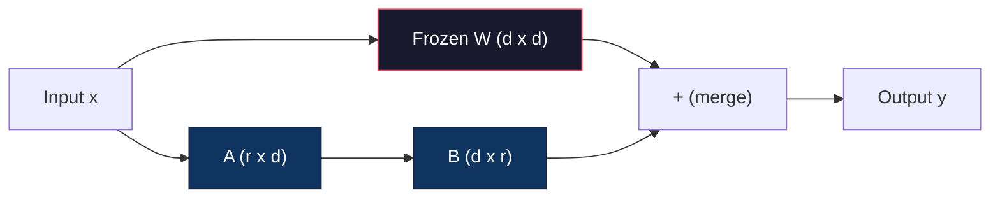
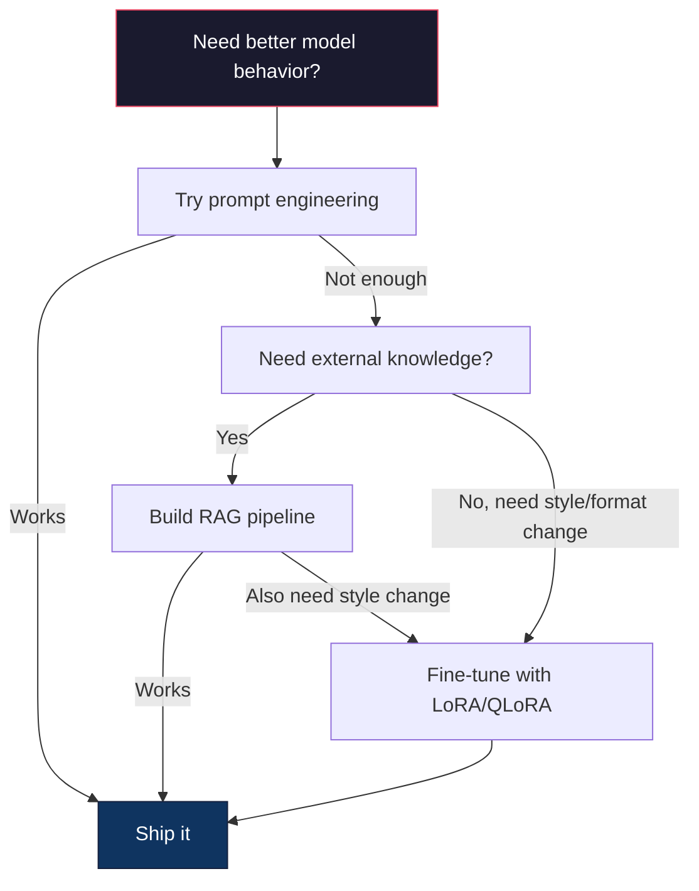

# 使用 LoRA 与 QLoRA 进行微调

> 全量微调一个 7B 模型需要 56GB 显存。你没有。大多数公司也没有。LoRA 让你可以在 6GB 显存中微调同一个模型，只训练不到 1% 的参数。这并非妥协——它在大多数任务上能达到全量微调的质量。整个开源微调生态系统都依赖于这一技巧。

**类型：** 构建
**语言：** Python
**前置知识：** 阶段 10，第 06 课（指令微调 / SFT）
**时间：** 约 75 分钟
**相关：** 阶段 10 从零开始覆盖了 SFT/DPO 循环。本节课将这些循环接入 2026 年的 PEFT 工具包（PEFT、TRL、Unsloth、Axolotl、LLaMA-Factory）。

## 学习目标

- 通过在预训练模型的注意力层中注入低秩适配器矩阵（A 和 B）来实现 LoRA
- 计算 LoRA 相比全量微调的参数节省：秩 r 配合 d_model 维度训练 2*r*d 个参数，而不是 d²
- 使用 QLoRA（4 位量化基座 + LoRA 适配器）微调模型，使其适配消费级 GPU 内存
- 将 LoRA 权重合并回基座模型用于部署，并比较有无适配器时的推理速度

## 问题

你有一个基座模型：Llama 3 8B。你想让它用你公司的语气回答客户支持工单。SFT 是答案。但 SFT 有成本问题。

全量微调会更新模型中的每一个参数。Llama 3 8B 有 80 亿个参数。在 fp16 下，每个参数占用 2 字节。仅加载权重就需要 16GB。训练过程中，你还需要梯度（16GB）、Adam 优化器状态（动量和方差共 32GB）以及激活值。总计：一个 8B 模型需要大约 56GB 显存。

一块 A100 80GB 勉强能装下。两块 A100 在云提供商处每小时花费 3-4 美元。在 50,000 个样本上训练 3 个 epoch 需要 6-10 小时。那就是每次实验 30-40 美元。运行 10 次实验来调整超参数，你在部署之前就已经花了 400 美元。

将这个规模扩大到 Llama 3 70B，数字就变得荒谬了。仅权重就需要 140GB。你需要一个集群。每次实验花费 100 美元以上。

还有一个更深层次的问题。全量微调会修改模型中的每一个权重。如果你在客户支持数据上微调，可能会降低模型的一般能力。这被称为灾难性遗忘。模型在你的任务上变得更好，却在其他所有任务上变得更差。

你需要一种训练更少参数、使用更少内存、并且不破坏模型已有知识的方法。

## 概念

### LoRA：低秩适配

Edward Hu 及其在微软的同事于 2021 年 6 月发表了 LoRA 论文。其洞见是：微调期间的权重更新具有低内在秩。你不需要更新一个 4096x4096 权重矩阵中的所有 1670 万个参数。更新中的有用信息可以被一个秩为 16 或 32 的矩阵捕捉。

以下是数学推导。一个标准线性层计算：

```
y = Wx
```

其中 W 是一个 d_out x d_in 矩阵。对于一个 4096x4096 的注意力投影，那就是 16,777,216 个参数。

LoRA 冻结了 W 并添加了一个低秩分解：

```
y = Wx + BAx
```

其中 B 是 (d_out x r) 矩阵，A 是 (r x d_in) 矩阵。秩 r 远小于 d——通常为 8、16 或 32。

对于 4096x4096 层的 r=16：
- 原始参数：4096 x 4096 = 16,777,216
- LoRA 参数：(4096 x 16) + (16 x 4096) = 65,536 + 65,536 = 131,072
- 缩减比例：131,072 / 16,777,216 = 0.78%

你只训练了 0.78% 的参数，却能获得 95-100% 的质量。



A 使用随机高斯分布初始化。B 初始化为零。这意味着 LoRA 的贡献从零开始——模型从原始行为开始训练，逐渐学习适配。

### 缩放因子：Alpha

LoRA 引入了一个缩放因子 alpha，用于控制低秩更新对输出的影响程度：

```
y = Wx + (alpha / r) * BAx
```

当 alpha = r 时，缩放倍数为 1 倍。当 alpha = 2r（常见的默认值）时，缩放倍数为 2 倍。这个超参数独立于基础学习率来控制 LoRA 路径的学习率。

实际指导：
- alpha = 2 * rank 是常见的社区约定（原始论文在大多数实验中使用了 alpha = rank）
- alpha = rank 给出 1 倍缩放，保守但稳定
- 更高的 alpha 意味着每步更新更大，可能加速收敛或导致不稳定

### 何处应用 LoRA

一个 Transformer 包含许多线性层。你不需要在所有层上都添加 LoRA。原始论文测试了不同的组合：

| 目标层 | 可训练参数（7B） | 质量 |
|--------|-------------------|------|
| 仅 q_proj | 4.7M | 良好 |
| q_proj + v_proj | 9.4M | 更好 |
| q_proj + k_proj + v_proj + o_proj | 18.9M | 注意力层最佳 |
| 所有线性层（注意力 + MLP） | 37.7M | 收益微小，参数量翻倍 |

大多数任务的最佳选择：q_proj + v_proj。这针对自注意力中的查询和数值投影，它们控制模型关注什么以及提取什么信息。对于代码生成等复杂任务，添加 MLP 层有帮助，但对于简单任务，参数量翻倍而收益递减。

### 秩的选择

秩 r 控制适配的表现力：

| 秩 | 每层可训练参数 | 最适合用于 |
|-----|-----------------|------------|
| 4 | 32,768 | 简单分类、情感分析 |
| 8 | 65,536 | 单领域问答、摘要 |
| 16 | 131,072 | 多领域任务、指令遵循 |
| 32 | 262,144 | 复杂推理、代码生成 |
| 64 | 524,288 | 大多数任务收益递减 |
| 128 | 1,048,576 | 很少有必要 |

Hu 等人表明，对于简单任务，r=4 已经能捕捉大部分适配。r=8 和 r=16 是实践中最常见的选择。超过 r=64 很少能改善质量，并且开始失去 LoRA 的内存优势。

### QLoRA：4 位量化 + LoRA

Tim Dettmers 及其在华盛顿大学的同事于 2023 年 5 月发表了 QLoRA。其想法是：将冻结的基座模型量化为 4 位精度，然后在其上附加 fp16 的 LoRA 适配器。

这极大地改变了内存方程：

| 方法 | 权重内存（7B） | 训练内存（7B） | 所需 GPU |
|------|----------------|----------------|----------|
| 全量微调（fp16） | 14GB | ~56GB | 1x A100 80GB |
| LoRA（fp16 基座） | 14GB | ~18GB | 1x A100 40GB |
| QLoRA（4 位基座） | 3.5GB | ~6GB | 1x RTX 3090 24GB |

QLoRA 做出了三项技术贡献：

**NF4（Normal Float 4 位）**：一种专门为神经网络权重设计的新数据类型。神经网络权重大致遵循正态分布。NF4 将其 16 个量化级别放置在标准正态分布的分位数上。这在信息论上对于正态分布的数据是最优的。与均匀 4 位量化（INT4）或标准 Float4 相比，它丢失的信息更少。

**双重量化**：量化常数本身占用内存。每 64 个权重的块需要一个 fp32 缩放因子（4 字节）。对于一个 7B 模型，这额外需要 0.4GB。双重量化将这些常数量化为 fp8，将开销降低到 0.1GB。虽然很小，但积少成多。

**分页优化器**：在训练过程中，优化器状态（Adam 的动量和方差）在长序列上可能超出 GPU 内存。分页优化器利用 NVIDIA 的统一内存，在 GPU 内存耗尽时自动将优化器状态分页到 CPU RAM，并在需要时再分页回来。这可以防止 OOM 崩溃，但会牺牲一些吞吐量。

### 质量问题

减少参数或量化基座会损害质量吗？来自多篇论文的结果：

| 方法 | MMLU（5-shot） | MT-Bench | HumanEval |
|------|----------------|----------|-----------|
| 全量微调（Llama 2 7B） | 48.3 | 6.72 | 14.6 |
| LoRA r=16 | 47.9 | 6.68 | 14.0 |
| QLoRA r=16（NF4） | 47.5 | 6.61 | 13.4 |
| QLoRA r=64（NF4） | 48.1 | 6.70 | 14.2 |

在大多数基准测试中，r=16 的 LoRA 与全量微调的差距在 1% 以内。r=16 的 QLoRA 又损失了零点几个百分点。r=64 的 QLoRA 基本上与全量微调持平，同时使用的内存减少了 90%。

### 实际成本

在 50,000 个样本上微调 Llama 3 8B（3 个 epoch）：

| 方法 | GPU | 时间 | 成本 |
|------|-----|------|------|
| 全量微调 | 2x A100 80GB | 8 小时 | ~32 美元 |
| LoRA r=16 | 1x A100 40GB | 4 小时 | ~8 美元 |
| QLoRA r=16 | 1x RTX 4090 24GB | 6 小时 | ~5 美元 |
| QLoRA r=16（Unsloth） | 1x RTX 4090 24GB | 2.5 小时 | ~2 美元 |
| QLoRA r=16 | 1x T4 16GB | 12 小时 | ~4 美元 |

在单块消费级 GPU 上进行 QLoRA 的费用比一顿午餐还便宜。这就是为什么开放权重的微调社区在 2023 年爆发，以及为什么到 2026 年下面的每一个训练框架都默认支持 QLoRA。

### 2026 年的 PEFT 栈

| 框架 | 是什么 | 何时选用 |
|-------|--------|----------|
| **Hugging Face PEFT** | 标准的 LoRA/QLoRA/DoRA/IA3 库 | 你需要原始控制，且训练循环已经基于 `transformers.Trainer` |
| **TRL** | HF 的强化反馈训练器（SFT、DPO、GRPO、PPO、ORPO） | 在 SFT 之后需要 DPO/GRPO；基于 PEFT 构建 |
| **Unsloth** | 对前向/反向传播的 Triton 内核重写 | 你需要 2-5 倍加速 + 一半显存且无精度损失；适用于 Llama/Mistral/Qwen 系列 |
| **Axolotl** | 基于 PEFT + TRL + DeepSpeed + Unsloth 的 YAML 配置封装 | 你需要可复现、版本控制的训练运行 |
| **LLaMA-Factory** | 基于 PEFT + TRL 的 GUI/CLI/API | 你需要零代码微调；支持 100+ 模型系列 |
| **torchtune** | 原生 PyTorch 配方，无 `transformers` 依赖 | 你需要最小化依赖，且你的组织已经在 PyTorch 上标准化 |

经验法则：研究用途或一次性实验 → PEFT。可重复的生产流水线 → 启用 Unsloth 内核的 Axolotl。临时原型开发 → LLaMA-Factory。

### 合并适配器

训练结束后，你会有两个东西：冻结的基座模型和一个很小的 LoRA 适配器（通常 10-100MB）。你可以选择：

1. **保持分离**：加载基座模型，然后在上面加载适配器。为不同任务切换适配器。这就是如何从一个基座模型提供多个微调变体服务。

2. **永久合并**：计算 W' = W + (alpha/r) * BA，并将结果保存为新的完整模型。合并后的模型与原始模型大小相同。没有推理开销。没有需要管理的适配器。

对于服务多个任务（客户支持适配器、代码适配器、翻译适配器），保持分离。对于部署单一专用模型，合并。

组合多个适配器的高级合并技术：

- **TIES-Merging**（Yadav 等人，2023 年）：修剪小幅参数，解决符号冲突，然后合并。减少适配器之间的干扰。
- **DARE**（Yu 等人，2023 年）：在合并之前随机丢弃适配器参数并重新缩放剩余部分。令人惊讶地有效于组合能力。
- **任务算术**：简单地对适配器权重进行加或减。添加一个“代码”适配器和一个“数学”适配器通常会产生一个两者都擅长的模型。

### 何时不进行微调

微调是第三选择，而不是第一选择。

**第一：提示工程。** 编写更好的系统提示。添加少量示例。使用思维链。这不需要任何成本，只需要几分钟。如果提示能让你达到 80% 的效果，你可能不需要微调。

**第二：RAG。** 如果模型需要了解你的特定数据（文档、知识库、产品目录），检索比将其烘焙到权重中更便宜且更易维护。参见第 06 课。

**第三：微调。** 当模型需要采用一种无法通过提示实现的特定风格、格式或推理模式时，使用此方法。当你需要一致的结构化输出时。当你需要将较大模型蒸馏到较小模型时。当延迟很重要且你无法承担少量示例提示带来的额外标记时。



## 动手构建

我们纯粹用 PyTorch 从零开始实现 LoRA。没有库。没有魔法。你将构建 LoRA 层，将其注入模型，训练它，然后将权重合并回来。

### 第 1 步：LoRA 层

```python
import torch
import torch.nn as nn
import math

class LoRALayer(nn.Module):
    def __init__(self, in_features, out_features, rank=8, alpha=16):
        super().__init__()
        self.rank = rank
        self.alpha = alpha
        self.scaling = alpha / rank

        self.A = nn.Parameter(torch.randn(in_features, rank) * (1 / math.sqrt(rank)))
        self.B = nn.Parameter(torch.zeros(rank, out_features))

    def forward(self, x):
        return (x @ self.A @ self.B) * self.scaling
```

A 使用缩放的随机值初始化。B 初始化为零。乘积 BA 从零开始，因此模型从原始行为开始。

### 第 2 步：LoRA 包装的线性层

```python
class LinearWithLoRA(nn.Module):
    def __init__(self, linear, rank=8, alpha=16):
        super().__init__()
        self.linear = linear
        self.lora = LoRALayer(
            linear.in_features, linear.out_features, rank, alpha
        )

        for param in self.linear.parameters():
            param.requires_grad = False

    def forward(self, x):
        return self.linear(x) + self.lora(x)
```

原始线性层被冻结。只有 LoRA 参数（A 和 B）是可训练的。

### 第 3 步：将 LoRA 注入模型

```python
def inject_lora(model, target_modules, rank=8, alpha=16):
    for param in model.parameters():
        param.requires_grad = False

    lora_layers = {}
    for name, module in model.named_modules():
        if isinstance(module, nn.Linear):
            if any(t in name for t in target_modules):
                parent_name = ".".join(name.split(".")[:-1])
                child_name = name.split(".")[-1]
                parent = dict(model.named_modules())[parent_name]
                lora_linear = LinearWithLoRA(module, rank, alpha)
                setattr(parent, child_name, lora_linear)
                lora_layers[name] = lora_linear
    return lora_layers
```

首先，冻结模型中的每个参数。然后遍历模型树，找到与你目标名称匹配的线性层，并用 LoRA 包装的版本替换它们。整个模型中，LoRA 的 A 和 B 矩阵是唯一可训练的参数。

### 第 4 步：统计参数

```python
def count_parameters(model):
    total = sum(p.numel() for p in model.parameters())
    trainable = sum(p.numel() for p in model.parameters() if p.requires_grad)
    frozen = total - trainable
    return {
        "total": total,
        "trainable": trainable,
        "frozen": frozen,
        "trainable_pct": 100 * trainable / total if total > 0 else 0
    }
```

### 第 5 步：合并权重回来

```python
def merge_lora_weights(model):
    for name, module in model.named_modules():
        if isinstance(module, LinearWithLoRA):
            with torch.no_grad():
                merged = (
                    module.lora.A @ module.lora.B
                ) * module.lora.scaling
                module.linear.weight.data += merged.T
            parent_name = ".".join(name.split(".")[:-1])
            child_name = name.split(".")[-1]
            if parent_name:
                parent = dict(model.named_modules())[parent_name]
            else:
                parent = model
            setattr(parent, child_name, module.linear)
```

合并后，LoRA 层消失了。模型与原始模型大小相同，适配已被烘焙到权重中。没有推理开销。

### 第 6 步：模拟 QLoRA 量化

```python
def quantize_to_nf4(tensor, block_size=64):
    blocks = tensor.reshape(-1, block_size)
    scales = blocks.abs().max(dim=1, keepdim=True).values / 7.0
    scales = torch.clamp(scales, min=1e-8)
    quantized = torch.round(blocks / scales).clamp(-8, 7).to(torch.int8)
    return quantized, scales

def dequantize_from_nf4(quantized, scales, original_shape):
    dequantized = quantized.float() * scales
    return dequantized.reshape(original_shape)
```

这通过在 64 个块的范围内将权重映射到 16 个离散级别来模拟 4 位量化。生产环境中的 QLoRA 使用 bitsandbytes 库在 GPU 上实现真正的 NF4。

### 第 7 步：训练循环

```python
def train_lora(model, data, epochs=5, lr=1e-3, batch_size=4):
    optimizer = torch.optim.AdamW(
        [p for p in model.parameters() if p.requires_grad], lr=lr
    )
    criterion = nn.MSELoss()

    losses = []
    for epoch in range(epochs):
        epoch_loss = 0.0
        n_batches = 0
        indices = torch.randperm(len(data["inputs"]))

        for i in range(0, len(indices), batch_size):
            batch_idx = indices[i:i + batch_size]
            x = data["inputs"][batch_idx]
            y = data["targets"][batch_idx]

            output = model(x)
            loss = criterion(output, y)

            optimizer.zero_grad()
            loss.backward()
            optimizer.step()

            epoch_loss += loss.item()
            n_batches += 1

        avg_loss = epoch_loss / n_batches
        losses.append(avg_loss)

    return losses
```

### 第 8 步：完整演示

```python
def demo():
    torch.manual_seed(42)
    d_model = 256
    n_classes = 10

    model = nn.Sequential(
        nn.Linear(d_model, 512),
        nn.ReLU(),
        nn.Linear(512, 512),
        nn.ReLU(),
        nn.Linear(512, n_classes),
    )

    n_samples = 500
    x = torch.randn(n_samples, d_model)
    y = torch.randint(0, n_classes, (n_samples,))
    y_onehot = torch.zeros(n_samples, n_classes).scatter_(1, y.unsqueeze(1), 1.0)

    data = {"inputs": x, "targets": y_onehot}

    params_before = count_parameters(model)

    lora_layers = inject_lora(
        model, target_modules=["0", "2"], rank=8, alpha=16
    )

    params_after = count_parameters(model)

    losses = train_lora(model, data, epochs=20, lr=1e-3)

    merge_lora_weights(model)
    params_merged = count_parameters(model)

    return {
        "params_before": params_before,
        "params_after": params_after,
        "params_merged": params_merged,
        "losses": losses,
    }
```

演示创建了一个小模型，将 LoRA 注入两个层，进行训练，然后合并权重。参数数量从全部可训练下降到 LoRA 训练期间的约 1% 可训练，然后在合并后恢复到原始架构。

## 使用它

在 Hugging Face 生态系统中，在真实模型上使用 LoRA 大约需要 20 行代码：

```python
from transformers import AutoModelForCausalLM, AutoTokenizer
from peft import LoraConfig, get_peft_model, TaskType

model = AutoModelForCausalLM.from_pretrained("meta-llama/Llama-3.1-8B")
tokenizer = AutoTokenizer.from_pretrained("meta-llama/Llama-3.1-8B")

lora_config = LoraConfig(
    task_type=TaskType.CAUSAL_LM,
    r=16,
    lora_alpha=32,
    lora_dropout=0.05,
    target_modules=["q_proj", "v_proj"],
)

model = get_peft_model(model, lora_config)
model.print_trainable_parameters()
```

对于 QLoRA，添加 bitsandbytes 量化：

```python
from transformers import BitsAndBytesConfig

bnb_config = BitsAndBytesConfig(
    load_in_4bit=True,
    bnb_4bit_quant_type="nf4",
    bnb_4bit_compute_dtype=torch.bfloat16,
    bnb_4bit_use_double_quant=True,
)

model = AutoModelForCausalLM.from_pretrained(
    "meta-llama/Llama-3.1-8B",
    quantization_config=bnb_config,
    device_map="auto",
)

model = get_peft_model(model, lora_config)
```

就这样。相同的训练循环。相同的流水线。基座模型现在位于 4 位，LoRA 适配器以 fp16 训练，整个东西适合 6GB。

使用 Hugging Face Trainer 进行训练：

```python
from transformers import TrainingArguments, Trainer
from datasets import load_dataset

dataset = load_dataset("tatsu-lab/alpaca", split="train[:5000]")

training_args = TrainingArguments(
    output_dir="./lora-llama",
    num_train_epochs=3,
    per_device_train_batch_size=4,
    gradient_accumulation_steps=4,
    learning_rate=2e-4,
    fp16=True,
    logging_steps=10,
    save_strategy="epoch",
    optim="paged_adamw_8bit",
)

trainer = Trainer(
    model=model,
    args=training_args,
    train_dataset=dataset,
)

trainer.train()

model.save_pretrained("./lora-adapter")
```

保存的适配器大小为 10-100MB。基座模型保持不变。你可以在 Hugging Face Hub 上共享适配器，而无需重新分发完整模型。

## 交付

本节课产出：
- `outputs/prompt-lora-advisor.md` —— 一个提示，帮助你针对特定任务决定 LoRA 秩、目标模块和超参数
- `outputs/skill-fine-tuning-guide.md` —— 一项技能，教给代理何时以及如何微调的决策树

## 练习

1. **秩消融研究。** 以秩 2、4、8、16、32 和 64 运行演示。绘制最终损失与秩的关系图。找出收益递减点，即加倍秩不再使损失减半。对于 256 维特征的简单分类任务，这应该在 r=8-16 左右。

2. **目标模块比较。** 修改 inject_lora，使其仅针对第“0”层、仅第“2”层、仅第“4”层以及所有三层。训练每个变体 20 个 epoch。比较收敛速度和最终损失。这反映了在实际中针对 q_proj 与 v_proj 与所有线性层的决策。

3. **量化误差分析。** 获取训练好的模型权重矩阵，在 quantize_to_nf4 / dequantize_from_nf4 前后计算均方误差、最大绝对误差以及原始和重建权重之间的相关性。尝试块大小为 32、64、128 和 256。

4. **多适配器服务。** 在数据的不同子集上训练两个 LoRA 适配器（偶数索引 vs 奇数索引）。保存两个适配器。加载基座模型一次，然后切换适配器，验证每个适配器在相同输入上产生不同的输出。这就是生产系统如何从一个基座模型提供多个微调模型服务。

5. **合并与未合并推理。** 在相同 100 个输入上比较合并后模型与合并前 LoRA 模型的输出。验证输出是否相同（在 1e-5 的浮点容差内）。然后对两者的推理速度进行基准测试——合并后的模型应该稍快，因为它是单个矩阵乘法而不是两个。

## 关键术语

| 术语 | 人们常说的 | 实际含义 |
|------|------------|----------|
| LoRA | “高效微调” | 低秩适配：冻结基座权重，训练两个小矩阵 A 和 B，它们的乘积近似于完整权重更新 |
| QLoRA | “在笔记本上微调” | 量化 LoRA：以 4 位 NF4 加载基座模型，在其上以 fp16 训练 LoRA 适配器，使得 7B 微调只需 6GB 显存 |
| 秩 (r) | “模型能学多少” | A 和 B 矩阵的内部维度；控制表现力与参数数量之间的权衡 |
| Alpha | “LoRA 学习率” | 应用于 LoRA 输出的缩放因子；alpha/r 缩放适配对最终输出的贡献 |
| NF4 | “4 位量化” | Normal Float 4：一种 4 位数据类型，量化级别位于正态分布分位数处，对神经网络权重最优 |
| 适配器 | “那个小的训练部分” | LoRA 的 A 和 B 矩阵，保存为单独文件（10-100MB），可在任何基座模型副本之上加载 |
| 目标模块 | “要对哪些层做 LoRA” | 注入 LoRA 适配器的特定线性层（q_proj、v_proj 等） |
| 合并 | “烘焙进去” | 计算 W + (alpha/r) * BA 并替换原始权重，消除推理时的适配器开销 |
| 分页优化器 | “训练时别 OOM” | 在 GPU 内存耗尽时将优化器状态（Adam 动量、方差）卸载到 CPU |
| 灾难性遗忘 | “微调搞坏了其他所有东西” | 当更新所有权重导致模型失去先前学到的能力时 |

## 进一步阅读

- Hu 等人，“LoRA: Low-Rank Adaptation of Large Language Models”（2021）—— 介绍低秩分解方法的原始论文，在 GPT-3 175B 上测试，秩最低仅为 4
- Dettmers 等人，“QLoRA: Efficient Finetuning of Quantized Language Models”（2023）—— 引入 NF4、双重量化和分页优化器，使得在单块 48GB GPU 上微调 65B 模型成为可能
- PEFT 库文档（huggingface.co/docs/peft）—— Hugging Face 生态系统中用于 LoRA、QLoRA 和其他参数高效方法的标准库
- Yadav 等人，“TIES-Merging: Resolving Interference When Merging Models”（2023）—— 组合多个 LoRA 适配器而不降低质量的技术
- [Rafailov 等人，“Direct Preference Optimization: Your Language Model is Secretly a Reward Model”（NeurIPS 2023）](https://arxiv.org/abs/2305.18290) —— DPO 推导；SFT 之后的偏好微调阶段，无需奖励模型。
- [TRL 文档](https://huggingface.co/docs/trl/) —— `SFTTrainer`、`DPOTrainer`、`KTOTrainer` 以及与 PEFT/bitsandbytes/Unsloth 的集成接口的官方参考。
- [Unsloth 文档](https://docs.unsloth.ai/) —— 融合内核，将微调吞吐量提高一倍且内存减半；TRL 之下的性能层。
- [Axolotl 文档](https://axolotl-ai-cloud.github.io/axolotl/) —— YAML 配置的多 GPU SFT/DPO/QLoRA 训练器；作为手写脚本的配置即代码替代方案。
