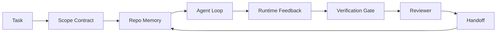

# Agent 工作台工程：为什么能力强的模型依然失败

> 一个能力强的模型还不够。可靠的代理需要一个工作台：指令、状态、范围、反馈、验证、审查和交接。剥离这些，即使前沿模型产出的工作也不安全，无法交付。

**类型：** 学习 + 构建  
**语言：** Python（标准库）  
**前置知识：** 阶段 14 · 01（代理循环），阶段 14 · 26（故障模式）  
**时间：** 约 45 分钟

## 学习目标

- 区分模型能力与执行可靠性。
- 指出决定代理能否交付的七个工作台层面。
- 对比在一个小型仓库任务上仅用提示词的运行与工作台引导的运行。
- 生成一份故障模式报告，将每个缺失的层面映射到它导致的症状。

## 问题

你将一个前沿模型放入一个真实的仓库，让它添加输入验证。它打开了四个文件，写了看似合理的代码，宣告成功，然后停止。你运行测试。两个失败了。还碰了一个与验证完全无关的第三个文件。没有记录显示代理假设了什么、先尝试了什么或者还有什么没做。

模型在 Python 方面并没有错。它在工作方面错了。它不知道什么算是完成、它可以在哪里写、哪些测试是权威的、以及下一个会话应该如何接手。

这不是模型错误。这是工作台错误。模型周围的层面缺失了将一次性生成变成可靠、可恢复工程的那些部分。

## 概念

工作台是在任务期间包裹模型的操作环境。它有七个层面：

| 层面 | 它承载什么 | 缺失时的故障 |
|------|------------|--------------|
| 指令（Instructions） | 启动规则、禁止操作、完成的定义 | 代理猜测交付意味着什么 |
| 状态（State） | 当前任务、接触过的文件、阻塞项、下一步操作 | 每个会话从零重新开始 |
| 范围（Scope） | 允许的文件、禁止的文件、验收标准 | 编辑泄露到不相关的代码中 |
| 反馈（Feedback） | 捕获到循环中的真实命令输出 | 代理在返回 400 时宣告成功 |
| 验证（Verification） | 测试、lint、冒烟运行、范围检查 | "看起来不错"到达主分支 |
| 审查（Review） | 由不同角色进行的第二轮检查 | 构建者给自己的作业判分 |
| 交接（Handoff） | 改变了什么、为什么改变、还有什么未完成 | 下一个会话重新发现一切 |

工作台与模型无关。你可以更换模型而保留这些层面。你不能更换这些层面而保留可靠性。



该循环在状态文件上闭合，而不是在聊天历史记录上闭合。聊天是易变的。仓库是记录系统。

### 工作台与提示词工程

提示词告诉模型这一轮你想要什么。工作台告诉模型跨轮次、跨会话如何工作。大多数代理失败故事是穿着提示词工程外衣的工作台失败。

### 工作台与框架

框架为你提供运行时（LangGraph、AutoGen、Agents SDK）。工作台为代理提供在该运行时内进行工作的场所。两者都需要。本迷你轨道是关于第二个的。

### 从原语而非供应商分类法进行推理

目前有很多关于“管控系统工程（harness engineering）”的文章。Addy Osmani、OpenAI、Anthropic、LangChain、Martin Fowler、MongoDB、HumanLayer、Augment Code、Thoughtworks、walkinglabs awesome 列表以及 Medium 和 Hacker News 的持续文章都在讨论它。它们对于管控系统的边界、范围以及使用什么词汇存在分歧。我们不需要站队。这七个层面是一个 UX 层；每个工作台之下都是支撑任何可靠后端所需的同一组分布式系统原语。

暂时去掉代理标签。一次代理运行是跨越时间、进程和机器的计算。要使其可靠，你需要任何生产系统都需要的那组原语。

| 原语 | 它是什么 | 它为代理承载什么 |
|--------|----------|------------------|
| 函数（Function） | 类型化处理函数。尽可能纯函数。拥有自己的输入和输出。 | 一次工具调用、一次规则检查、一次验证步骤、一次模型调用 |
| 工作器（Worker） | 长期运行的进程，拥有一个或多个函数和一个生命周期 | 构建者、审查者、验证者、MCP 服务器 |
| 触发器（Trigger） | 调用函数的事件源 | 代理循环滴答、HTTP 请求、队列消息、cron、文件变更、钩子 |
| 运行时（Runtime） | 决定什么在何处运行、使用什么超时和资源的边界 | Claude Code 的进程、LangGraph 的运行时、工作器容器 |
| HTTP / RPC | 调用者和工作器之间的通信线路 | 工具调用协议、MCP 请求、模型 API |
| 队列（Queue） | 触发器和工作器之间的持久缓冲；背压、重试、幂等性 | 任务板、反馈日志、审查收件箱 |
| 会话持久化（Session persistence） | 能够承受崩溃、重启、模型更换的状态 | `agent_state.json`、检查点、KV 存储、仓库本身 |
| 授权策略（Authorization policy） | 谁可以用哪个范围调用哪个函数 | 允许/禁止的文件、批准边界、MCP 能力列表 |

现在将七个工作台层面映射到这些原语上。

- **指令** —— 策略 + 函数元数据。规则是检查（函数）。路由器（`AGENTS.md`）是附加在运行时启动时的策略。
- **状态** —— 会话持久化。运行时每一步都读取的带键存储。文件、KV 或 DB；持久化语义重要，存储后端不重要。
- **范围** —— 每个任务的授权策略。允许/禁止的通配符是一个 ACL。所需的批准是一个权限格。
- **反馈** —— 写入队列的调用日志。每个 shell 调用都是一个记录，持久、可重放。
- **验证** —— 一个函数。在输入上具有确定性。在任务关闭时触发。失败时停止。
- **审查** —— 一个独立的工作器，对构建者工件具有只读授权，对审查报告具有只写授权。
- **交接** —— 由会话结束触发器发出的持久记录。下一个会话的启动触发器读取它。

代理循环本身是一个工作器，它消费事件（用户消息、工具结果、计时器滴答）、调用函数（模型，然后是模型选择的工具）、写入记录（状态、反馈）并发出触发器（验证、审查、交接）。没什么神秘的；和作业处理器的形状相同。

### 流通中的模式，翻译成原语

每个流行的管控系统模式都可以简化为八个原语。对照表。

| 供应商或社区模式 | 它实际上是什么 |
|------------------|----------------|
| Ralph 循环（Claude Code、Codex、agentic_harness 书）—— 当代理试图提前停止时，将原始意图重新注入一个干净的上下文窗口 | 一个触发器，将任务以干净上下文重新入队；会话持久化将目标向前推进 |
| 计划/执行/验证（PEV） | 三个工作器，每个承担一个角色，通过状态和阶段之间的队列进行通信 |
| 管控系统-计算分离（OpenAI Agents SDK，2026 年 4 月）—— 将控制平面与执行平面分开 | 重申控制平面/数据平面。比代理标签早了几十年 |
| 开放代理通行证（OAP，2026 年 3 月）—— 在执行之前，对每个工具调用声明式策略进行签名和审计 | 一个由预操作工作器强制执行的授权策略，带有签名的审计队列 |
| 指南与传感器（Birgitta Böckeler / Thoughtworks）—— 前馈规则 + 反馈可观察性 | 授权策略 + 验证函数 + 可观察性追踪 |
| 渐进式压缩，5 阶段（Claude Code 逆向工程，2026 年 4 月） | 一个状态管理工作器，像 cron 一样在会话持久化上运行以将其保持在预算内 |
| 钩子/中间件（LangChain、Claude Code）—— 拦截模型和工具调用 | 包裹在运行时调用路径周围的触发器 + 函数 |
| 渐近式技能（Anthropic、Flue） | 一个函数注册表，其中函数元数据在需要时加载到上下文中 |
| 沙箱代理（Codex、Sandcastle、Vercel Sandbox） | 计算平面：具有隔离文件系统、网络和生命周期的运行时 |
| MCP 服务器 | 通过稳定的 RPC 暴露函数的工作器，带有能力列表作为授权 |

该表中的每一项都是代理社区到达一个在分布式系统中已有名称的原语并给它起了一个新名字。用于营销的有用标签；作为工程词汇则无用。

### 数据实际上说了什么

关于管控系统优于模型的论断现在有了数据支持。值得了解，因为它们也是反对“只要等待更智能的模型”的唯一诚实论据。

- Terminal Bench 2.0 —— 相同模型，管控系统变更将一个编码代理从排名 30 之外移到了第 5 名（LangChain，*管控系统解剖*）。
- Vercel —— 删除了代理 80% 的工具；成功率从 80% 跃升至 100%（MongoDB）。
- Harvey —— 仅通过管控系统优化，法律代理的准确率提高了一倍以上（MongoDB）。
- 88% 的企业 AI 代理项目未能进入生产。失败集中在运行时，而非推理（preprints.org，*语言代理的管控系统工程*，2026 年 3 月）。
- 2025 年一项跨三个流行开源框架的基准研究报告了约 50% 的任务完成率；长上下文 WebAgent 从 40-50% 下降到 10% 以下，主要是由于无限循环和目标丢失（在 2026 年初的许多文章中都有报道）。

启示不是“管控系统永远胜利”。模型确实会随着时间的推移吸收管控系统技巧。启示是，今天，承载重量的工程是在模型周围，而不是在模型内部，而承载这个重量的原语正是每个生产系统一直需要的那些。

### 供应商文章止步的地方

这是你需要对礼貌说再见的章节。

- LangChain 的*管控系统解剖*列举了十一个组件——提示词、工具、钩子、沙箱、编排、内存、技能、子代理和一个“愚笨循环”运行时。它没有命名队列、工作器作为部署单元、触发器语义、会话持久化作为独立关注点，或授权策略。它将管控系统视为一个你可以配置的对象，而不是一个你需要部署的系统。
- Addy Osmani 的*代理管控系统工程*提出了 `Agent = Model + Harness` 的框架和棘轮模式，但没有说明管控系统是由什么构建的。它更像是一个立场，而不是一个规范。
- Anthropic 和 OpenAI 在层面方面走得最深，但都停留在自己的运行时内。2026 年 4 月 Agents SDK 中的“管控系统-计算分离”公告是第一个供应商文章明确认可控制平面/数据平面分离。这是一个原语思想，而不是新思想。
- agentic_harness 书将管控系统视为一个配置对象（Jaymin West 的*代理工程*，第 6 章），其中最有力的一句话是“管控系统是代理系统中的主要安全边界”。这只是授权策略的重新表述。
- Hacker News 线程不断到达同一个地方。2026 年 4 月的线程*代理管控系统应位于沙箱之外*认为管控系统应该更像一个位于一切外部、基于上下文和用户授权访问的“hypervisor”。这再次说明授权策略是一个独立的平面。

你不需要不同意这些文章中的任何一篇就能注意到这个空白。它们正在为一个已经存在的系统编写 UX 描述。我们正在编写系统本身。当系统构建正确时，七个层面会从原语中自然产生。当系统构建错误时，再多的 `AGENTS.md` 润色也无法修复缺失的队列。

所以当你在别处听到“管控系统工程”时，将其翻译成原语。提示词和规则是策略和函数。脚手架是运行时。护栏是授权 + 验证。钩子是触发器。内存是会话持久化。Ralph 循环是重新入队。子代理是工作器。沙箱是计算平面。词汇在变化；工程不变。工作台是面向代理的 UX；管控系统（在能够经受住下一次供应商重构的意义上）是正确连接在一起的原语：函数、工作器、触发器、运行时、队列、持久化和策略。

## 构建它

`code/main.py` 运行一个微型仓库任务两次。第一次仅用提示词，第二次连接七个层面。相同模型，相同任务。脚本计算了失败运行中缺失了哪些层面，并打印一份故障模式报告。

仓库任务故意设计得很小：给一个单文件的 FastAPI 风格处理程序添加输入验证并编写一个通过的测试。

运行它：

```
python3 code/main.py
```

输出：两个运行的并排日志、一个总结提示词运行的 `failure_modes.json`，以及工作台运行的一行结论。

代理是一个基于规则的微小存根；重点是层面，而不是模型。在本迷你轨道的剩余部分中，你将把每个层面重新构建为真实、可复用的工件。

## 使用它

三个地方已经存在工作台层面，即使没有人这样称呼它们：

- **Claude Code、Codex、Cursor。** `AGENTS.md` 和 `CLAUDE.md` 是指令层面。斜杠命令是范围。钩子是验证。
- **LangGraph、OpenAI Agents SDK。** 检查点和会话存储是状态层面。交接是交接层面。
- **真实仓库上的 CI。** 测试、lint 和类型检查是验证。PR 模板是交接。CODEOWNERS 是审查。

工作台工程是使这些层面明确和可复用的纪律，而不是让每个团队重新发现它们。

## 交付它

`outputs/skill-workbench-audit.md` 是一个可移植的技能，用于审计现有仓库的七个工作台层面，并报告哪些缺失、哪些不完整、哪些健康。将其放在任何代理设置旁边；它会告诉你首先修复什么。

## 练习

1. 选择一个你已经运行代理的仓库。给七个层面打分，从 0（缺失）到 2（健康）。你最薄弱的层面是什么？
2. 扩展 `main.py`，使得仅提示词的运行也产生一个虚假的“成功”声明。验证验证门控本应捕捉到它。
3. 为你自己的产品添加第八个层面。证明它不会归结到现有的七个层面之一。
4. 用另一个产生幻觉写入额外文件的存根代理重新运行脚本。哪个层面最先捕捉到它？
5. 将阶段 14 · 26 中五个行业反复出现的故障模式映射到七个层面。每个层面设计用于吸收哪种模式？

## 关键术语

| 术语 | 人们所说的 | 实际含义 |
|------|------------|----------|
| 工作台（Workbench） | “设置” | 围绕模型设计的、使工作可靠的工程化层面 |
| 层面（Surface） | “文档”或“脚本” | 一个命名的、机器可读的输入，代理每一轮读取或写入 |
| 记录系统（System of record） | “笔记” | 当聊天历史消失时，代理视为真相的文件 |
| 完成的定义（Definition of done） | “验收” | 客观的、基于文件的检查清单，代理无法伪造 |
| 工作台审计（Workbench audit） | “仓库就绪检查” | 对七个层面的检查，在开始工作前标记缺失的部分 |

## 进一步阅读

将这些作为数据点阅读，而非权威。每一个都是部分分类法。在决定是否采用之前，将每个概念翻译回原语（函数、工作器、触发器、运行时、HTTP/RPC、队列、持久化、策略）。

供应商框架：

- [Addy Osmani, Agent Harness Engineering](https://addyosmani.com/blog/agent-harness-engineering/) —— `Agent = Model + Harness` 和棘轮模式；基础设施方面较薄弱
- [LangChain, The Anatomy of an Agent Harness](https://blog.langchain.com/the-anatomy-of-an-agent-harness/) —— 十一个组件：提示词、工具、钩子、编排、沙箱、内存、技能、子代理、运行时；省略了队列、部署、授权
- [OpenAI, Harness engineering: leveraging Codex in an agent-first world](https://openai.com/index/harness-engineering/) —— Codex 团队对其运行时周围层面的看法
- [OpenAI, Unrolling the Codex agent loop](https://openai.com/index/unrolling-the-codex-agent-loop/) —— 代理循环简化为一个 `while` 加上函数调用
- [Anthropic, Effective harnesses for long-running agents](https://www.anthropic.com/engineering/effective-harnesses-for-long-running-agents) —— 特定运行时内的长周期层面
- [Anthropic, Harness design for long-running application development](https://www.anthropic.com/engineering/harness-design-long-running-apps) —— 应用设计笔记
- [LangChain Deep Agents harness capabilities](https://docs.langchain.com/oss/python/deepagents/harness) —— 运行时配置层面

带有可用细节的实践者文章：

- [Martin Fowler / Birgitta Böckeler, Harness engineering for coding agent users](https://martinfowler.com/articles/harness-engineering.html) —— 指南（前馈）+ 传感器（反馈）；最清晰的管控理论框架
- [HumanLayer, Skill Issue: Harness Engineering for Coding Agents](https://www.humanlayer.dev/blog/skill-issue-harness-engineering-for-coding-agents) —— “不是模型问题，而是配置问题”
- [MongoDB, The Agent Harness: Why the LLM Is the Smallest Part of Your Agent System](https://www.mongodb.com/company/blog/technical/agent-harness-why-llm-is-smallest-part-of-your-agent-system) —— 数据：Vercel 80% 到 100%，Harvey 2 倍准确率，Terminal Bench 前 30 到前 5
- [Augment Code, Harness Engineering for AI Coding Agents](https://www.augmentcode.com/guides/harness-engineering-ai-coding-agents) —— 约束优先的指南
- [Sequoia podcast, Harrison Chase on Context Engineering Long-Horizon Agents](https://sequoiacap.com/podcast/context-engineering-our-way-to-long-horizon-agents-langchains-harrison-chase/) —— 运行时关注点优于模型关注点

书籍、论文和参考实现：

- [Jaymin West, Agentic Engineering — Chapter 6: Harnesses](https://www.jayminwest.com/agentic-engineering-book/6-harnesses) —— 书长度的论述，将管控系统视为主要安全边界
- [preprints.org, Harness Engineering for Language Agents (March 2026)](https://www.preprints.org/manuscript/202603.1756) —— 学术框架：管控/代理/运行时
- [walkinglabs/awesome-harness-engineering](https://github.com/walkinglabs/awesome-harness-engineering) —— 精选阅读列表，涵盖上下文、评估、可观察性、编排
- [ai-boost/awesome-harness-engineering](https://github.com/ai-boost/awesome-harness-engineering) —— 另一个精选列表（工具、评估、内存、MCP、权限）
- [andrewgarst/agentic_harness](https://github.com/andrewgarst/agentic_harness) —— 生产就绪参考实现，带有 Redis 支持的内存和评估套件
- [HKUDS/OpenHarness](https://github.com/HKUDS/OpenHarness) —— 开源代理管控系统，内置个人代理

值得阅读 Hacker News 线程，看分歧而非共识：

- [HN: Effective harnesses for long-running agents](https://news.ycombinator.com/item?id=46081704)
- [HN: Improving 15 LLMs at Coding in One Afternoon. Only the Harness Changed](https://news.ycombinator.com/item?id=46988596)
- [HN: The agent harness belongs outside the sandbox](https://news.ycombinator.com/item?id=47990675) —— 主张授权作为一个独立平面

本课程体系中的交叉引用：

- 阶段 14 · 23 —— OpenTelemetry GenAI 约定：传感器文献指向的可观察性层
- 阶段 14 · 26 —— 七个层面设计用于吸收的故障模式目录
- 阶段 14 · 27 —— 位于授权策略原语层面的提示词注入防御
- 阶段 14 · 29 —— 生产运行时（队列、事件、cron）：本课中原语在部署中的位置
