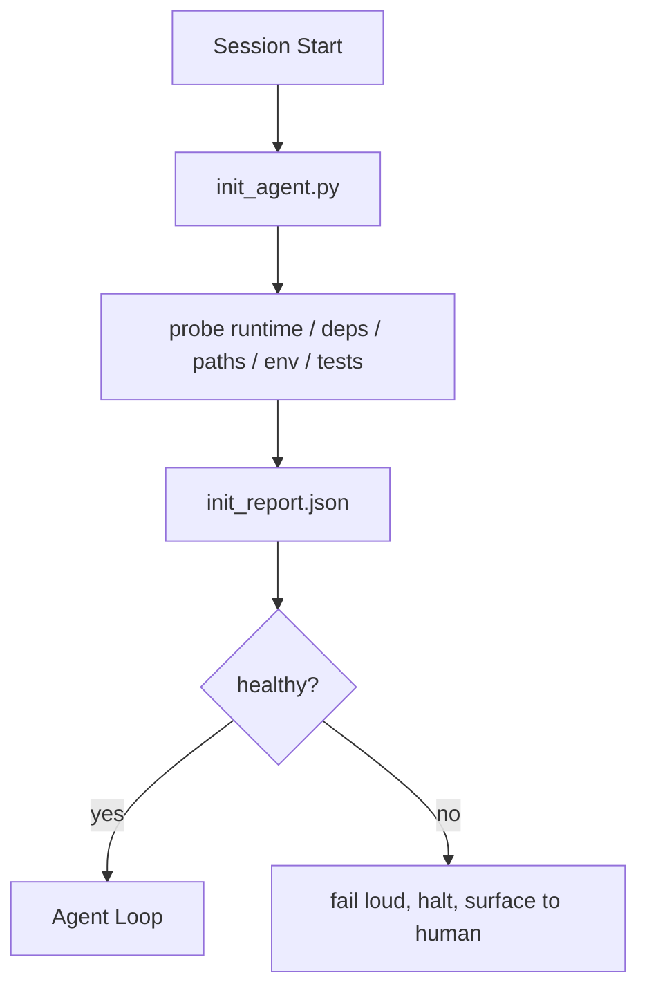

# 代理的初始化脚本

> 每次冷启动的会话都要付出代价。代理读取相同的文件、重试相同的探测、重新发现相同的路径。初始化脚本一次性支付代价，并将答案写入状态。

**类型：** 构建  
**语言：** Python（标准库）  
**前置条件：** 阶段14・32（最小工作台）、阶段14・34（仓库记忆）  
**时间：** 约45分钟  

## 学习目标

- 识别代理永远不应在每个会话中重复完成的工作。
- 构建一个确定性的初始化脚本，用于探测运行时、依赖项和仓库健康状态。
- 持久化探测结果，使代理直接读取而非重新运行检查。
- 在初始化失败时，能够大声、快速失败，并提供一个集中的检查位置。

## 问题

打开一个会话。代理猜测 Python 版本。猜测测试命令。五次列出仓库根目录以找到入口点。尝试导入一个未安装的包。向用户询问配置文件的位置。当它真正做出编辑时，已经花费了一万个 token 在那些本应是一个脚本就能完成的设置工作上。

解决方案是一个初始化脚本，在代理做任何其他事之前运行，并写入一个 `init_report.json`，代理在启动时读取。

## 概念



### 初始化脚本探测的内容

| 探测项 | 重要性 |
|-------|--------|
| 运行时版本 | 错误的 Python 或 Node 版本意味着静默的错误版本 bug |
| 依赖项可用性 | 缺失的包后期排查成本是现在捕获它的十倍 |
| 测试命令 | 代理必须知道如何验证；如果命令缺失，工作台就坏了 |
| 仓库路径 | 硬编码的路径会漂移；一次性解析并固定 |
| 环境变量 | 缺失 `OPENAI_API_KEY` 是一个故障面，而不是运行时谜团 |
| 状态与面板新鲜度 | 崩溃会话的过期状态是一个隐患 |
| 上次已知良好提交 | 为会话结束时的交接差异提供锚点 |

### 大声失败，快速失败，集中失败

探测失败意味着停止运行并告知用户。不要想着“代理会自己解决”。初始化的全部意义在于当工作台损坏时拒绝启动。

### 幂等性

连续运行两次。第二次运行除了刷新时间戳外应无任何操作。幂等性使得你可以将脚本集成到 CI、钩子或预任务斜杠命令中。

### 初始化与启动规则

规则（阶段14・33）描述了为了行动必须为真的条件。初始化是建立这些规则可被检查的脚本。没有初始化的规则会变成“小心行事”。没有规则的初始化变成一次漂亮的失败。

## 构建它

`code/main.py` 实现了 `init_agent.py`：

- 五个探测：Python 版本、通过 `importlib.util.find_spec` 列出的依赖项、测试命令的可解析性、必需的环境变量、状态文件的新鲜度。
- 每个探测返回 `(name, status, detail)`。
- 脚本写入 `init_report.json` 包含完整的探测集，如果任何阻止级别的探测失败则非零退出。

运行它：

```
python3 code/main.py
```

脚本打印探测表格，写入 `init_report.json`，并在正常路径上以零退出，或非零退出并列出失败的探测。

## 生产环境中的模式

三个模式将一个有用的初始化脚本与仪式感区分开来。

**上次已知良好提交锚定。** 将当前提交与上次成功合并时写入的 `LKG` 文件进行比对。如果差异超出预算（默认 50 个文件），则拒绝启动并要求人工确认新基线。Cloudflare 的 AI 代码审查使用此方法来限定审查代理的作用范围：每个审查会话都锚定在同一个上次已知良好提交上，不会在会话之间累积漂移。

**具有 TTL 的锁文件。** 首次成功探测通过后写入 `prereqs.lock`。后续运行在 N 小时内（默认 24 小时）信任该锁，并跳过昂贵的探测。初始化脚本首先读取锁；如果锁新鲜且依赖清单哈希匹配，则短路。这与 Docker 用于层缓存的模式相同：幂等探测 + 内容哈希 = 跳过。

**热路径中无网络、无 LLM、无意外。** 初始化探测是确定性的管道工程。调用 LLM 来分类故障或访问外部服务检查许可证的探测不是探测，而是工作流。如果某个探测在干运行中耗时超过三秒，则将其视为工作台异味，要么将其移出初始化，要么缓存其结果。

## 使用它

在生产环境中：

- **Claude Code 钩子。** `pre-task` 钩子调用初始化脚本，如果失败则拒绝启动代理。
- **GitHub Actions。** 一个 `setup-agent` 作业运行初始化脚本；代理作业依赖它。
- **Docker 入口点。** 代理容器在执行代理运行时之前运行初始化脚本；失败时日志会上报。

初始化脚本是可移植的，因为它不调用特定框架。Bash、Make 或任务文件都可以封装它。

## 交付它

`outputs/skill-init-script.md` 对项目进行访谈，将其设置工作分类为探测，并输出特定于项目的 `init_agent.py` 以及一个 CI 工作流，该工作流在任何代理步骤之前运行它。

## 练习

1. 添加一个探测，将当前提交与上次已知良好提交进行差异比较，如果更改的文件超过 50 个则拒绝启动。
2. 将脚本改为写入 `prereqs.lock` 文件，如果锁文件超过七天则拒绝启动。
3. 添加 `--fix` 标志，自动安装缺失的开发依赖项，但未经批准绝不修改运行时依赖项。
4. 将探测从硬编码函数迁移到 YAML 注册表。为这一取舍进行辩护。
5. 为每个探测添加时间预算。运行时间超过三秒的探测视为工作台异味。

## 关键术语

| 术语 | 人们常说的 | 实际含义 |
|------|-----------|----------|
| 探测 | “一个检查” | 一个返回 `(name, status, detail)` 的确定性函数 |
| 初始化报告 | “设置输出” | 与状态文件相邻写入的 JSON，包含探测结果 |
| 幂等 | “可安全重运行” | 连续运行两次，除时间戳外产生相同的报告 |
| 大声失败 | “不要吞掉” | 停止并告知用户；无静默回退 |
| 设置税 | “启动成本” | 代理每个会话重新发现显而易见事物的 token 开销 |

## 延伸阅读

- [Anthropic, Effective harnesses for long-running agents](https://www.anthropic.com/engineering/effective-harnesses-for-long-running-agents)
- [GitHub Actions, composite actions for setup](https://docs.github.com/en/actions/sharing-automations/creating-actions/creating-a-composite-action)
- [microservices.io, GenAI dev platform: guardrails](https://microservices.io/post/architecture/2026/03/09/genai-development-platform-part-1-development-guardrails.html) — 将 pre-commit + CI 检查作为初始化
- [Augment Code, How to Build Your AGENTS.md (2026)](https://www.augmentcode.com/guides/how-to-build-agents-md) — 初始化期望
- [Codex Blog, Codex CLI Context Compaction](https://codex.danielvaughan.com/2026/03/31/codex-cli-context-compaction-architecture/) — 将会话启动视为压缩感知的初始化
- 阶段14・33 — 此脚本所启用的规则集
- 阶段14・34 — 此脚本所植入的状态文件
- 阶段14・38 — 初始化脚本所馈送的验证门
- 阶段14・40 — 消费初始化报告中上次已知良好提交的交接
