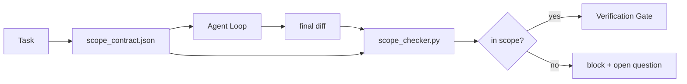

# 范围合约与任务边界

> 模型不知道工作在哪里结束。范围合约是一个按任务划分的文件，它说明工作从哪里开始、在哪里结束，以及在超出范围时如何回滚。这份合约将“保持范围”从一句愿望变成了一个检查。

**类型：** 构建
**语言：** Python（标准库）
**前置条件：** 阶段 14 · 32（最小工作台）、阶段 14 · 33（规则即约束）
**时间：** 约 50 分钟

## 学习目标

- 编写一份范围合约，代理在任务开始时读取它，验证器在任务结束时读取它。
- 指定允许的文件、禁止的文件、验收标准、回滚计划以及审批边界。
- 实现一个范围检查器，将差异（diff）与合约进行比较并标记违规。
- 使范围蔓延变得可见、自动化和可审查。

## 问题所在

代理会蔓延。任务是“修复登录 bug”。差异（diff）却涉及了登录路由、邮件助手、数据库驱动、README 和发布脚本。每一次修改在当时都有看似合理的理由。但它们合在一起，就变成了与审查时不同的更改。

范围蔓延是代理工作中最容易被忽视的失败模式，因为代理会善意地叙述每一步。解决方案不是更严格的提示词，而是磁盘上的一份合约，其中写明了承诺，以及一个将结果与承诺进行比较的检查。

## 概念



### 范围合约包含什么

| 字段 | 用途 |
|-------|---------|
| `task_id` | 关联到看板上的任务 |
| `goal` | 一句话，可供审查者验证 |
| `allowed_files` | 代理可以写入的 glob 模式 |
| `forbidden_files` | 代理即使意外也不得触碰的 glob 模式 |
| `acceptance_criteria` | 证明任务完成的测试命令或断言行 |
| `rollback_plan` | 一段话，操作员在需要停止时可执行的回滚步骤 |
| `approvals_required` | 超出范围、需要明确人工审批的操作 |

没有 `forbidden_files` 的合约是不完整的。负空间是合约的一半。

### 使用 glob 模式，而非原始路径

真实的仓库会移动文件。将合约绑定到 glob 模式（例如 `app/**/*.py`、`tests/test_signup*.py`），这样在会话之间进行重构时不会使合约失效。

### 回滚是范围的一部分

列出如何回滚，迫使合约作者思考可能出错的地方。一个无法回滚的合约，是不应被批准的合约。

### 范围检查就是差异（diff）检查

代理产生一个差异。检查器读取该差异、允许的 glob、禁止的 glob 以及任何已运行的验收命令列表。每个违规都是一个带标签的发现项，验证门可以据此拒绝。

## 构建它

`code/main.py` 实现了：

- `scope_contract.json` 模式（JSON Schema 的子集，包含 glob 数组）。
- 一个差异解析器，将修改的文件列表加上运行命令列表转换为 `RunSummary`。
- 一个 `scope_check` 函数，返回 `(violations, in_scope, off_scope)`（针对合约）。
- 两个演示运行：一个保持在范围内，另一个发生蔓延。检查器会标记蔓延，并指出确切的文件和原因。

运行它：

```
python3 code/main.py
```

输出：合约、两次运行、每次运行的判定结果，以及保存的 `scope_report.json`。

## 真实环境中的生产模式

一位从业者运行“规格最大化”（在调用代理之前用 YAML 编写范围合约）报告称，兔子洞率在 3 周内从 52% 降到了 21%，而代理本身并未改变。是合约起了作用，而不是模型。以下三种模式能让这一成果持续下去。

**违规预算，而非二元失败。** `agent-guardrails`（用于 Claude Code、Cursor、Windsurf、Codex（通过 MCP）的开源合并门）为每个任务提供了 `violationBudget`：在预算内的轻微范围滑移会作为警告呈现；只有当预算被超出时，合并门才会拒绝。结合 `violationSeverity: "error" | "warning"`。预算是区分一个能正常运行的合并门和一个被团队讨厌并禁用的合并门的关键。

**按路径族别的严重性不对称。** 对 `docs/**` 的越界写入通常是 `warn`（警告）；对 `scripts/**`、`migrations/**`、`config/prod/**` 的越界写入则总是 `block`（阻止）。这种不对称必须存在于合约中，而非运行时，因为它是项目特定的，并且每个任务都会变化。

**文件预算旁边的时间和网络预算。** 一个 `time_budget_minutes` 字段限定了墙上时钟时间；运行时会拒绝在超出该时间后继续执行，除非重新审批。一个 `network_egress` 白名单（基于主机名）防止代理静默访问未包含在任务中的外部 API。这些也是范围的维度；文件 glob 是必要的，但还不够。

**多重合约合并语义（最小权限）。** 当两个范围合约同时适用时（例如，一个项目范围的合约加一个任务特定的合约），合并规则为：**交集** `allowed_files`（两个合约都必须允许该路径），**并集** `forbidden_files`（任一合约都可以禁止），`time_budget_minutes` 取最严格的（最小值），`approvals_required` 累积。`network_egress` 为 `None` 表示不强制，`[]` 表示全部拒绝，`[...]` 作为白名单；合并时，`None` 由另一方决定，两个列表取交集，全部拒绝保持为全部拒绝。在合约模式中陈述这一点，以便合并过程是机械化的且可审查的。

## 使用它

生产模式：

- **Claude Code 的斜杠命令。** 一个 `/scope` 命令编写合约并将其固定为会话上下文。子代理在执行前读取合约。
- **GitHub PR。** 将合约作为 JSON 文件推送到 PR 正文中或作为检入的工件。CI 针对合并差异运行范围检查器。
- **LangGraph 中断。** 范围违规触发中断；处理程序询问人类：是合约需要扩展，还是代理需要后退。

合约随任务一起传递。当任务关闭时，合约归档到 `outputs/scope/closed/` 下。

## 发布它

`outputs/skill-scope-contract.md` 根据任务描述生成一份范围合约，以及一个在 CI 中针对每次代理差异运行的 glob 感知检查器。

## 练习

1. 添加一个 `network_egress` 字段，列出允许的外部主机。拒绝触碰其他主机的运行。
2. 扩展检查器，使其对 `docs/**` 软性失败（仅警告），对 `scripts/**` 硬性失败（直接阻止）。说明这种不对称的理由。
3. 使合约从 `goal` 字段使用静态规则集（无 LLM）推导出 `allowed_files`。在第一个边界情况下会出现什么问题？
4. 添加 `time_budget_minutes` 并在墙上时钟超出该时间时拒绝继续执行。
5. 对同一个差异运行两个合约。当两者都适用时，正确的合并语义是什么？

## 关键术语

| 术语 | 人们常说的 | 实际含义 |
|------|----------------|------------------------|
| 范围合约 | “任务简介” | 按任务划分的 JSON 文件，列出允许/禁止的文件、验收标准、回滚计划 |
| 范围蔓延 | “它还碰了……” | 在同一个任务中，合约之外的文件被修改 |
| 回滚计划 | “我们可以回退” | 一段供操作员执行的停止运行手册 |
| 审批边界 | “需要审批” | 合约中列出的、需要明确人工批准的操作 |
| 差异检查 | “路径审计” | 将修改的文件与合约中的 glob 模式进行比较 |

## 进一步阅读

- [LangGraph 人工介入中断](https://langchain-ai.github.io/langgraph/concepts/human_in_the_loop/)
- [OpenAI Agents SDK 工具审批策略](https://platform.openai.com/docs/guides/agents-sdk)
- [logi-cmd/agent-guardrails — 合并门与范围验证](https://github.com/logi-cmd/agent-guardrails) — 违规预算、严重性等级
- [Dev|Journal, Preventing AI Agent Configuration Drift with Agent Contract Testing](https://earezki.com/ai-news/2026-05-05-i-built-a-tiny-ci-tool-to-keep-ai-agent-configs-from-drifting-in-my-repo/) — 无外部依赖的 `--strict` 模式
- [Agentic Coding Is Not a Trap (production logs)](https://dev.to/jtorchia/agentic-coding-is-not-a-trap-i-answered-the-viral-hn-post-with-my-own-production-logs-33d9) — 规格最大化实证：52% → 21%
- [OpenCode 权限 glob](https://opencode.ai/docs/agents/) — 细粒度、按权限划分的范围
- [Knostic, AI Coding Agent Security: Threat Models and Protection Strategies](https://www.knostic.ai/blog/ai-coding-agent-security) — 范围作为最小权限的一部分
- [Augment Code, AI Spec Template](https://www.augmentcode.com/guides/ai-spec-template) — 三层边界系统（必须/询问/绝不）
- 阶段 14 · 27 — 与范围锁配对的提示注入防御
- 阶段 14 · 33 — 本合约按任务特化的规则集
- 阶段 14 · 38 — 检查器向其报告的验证门
