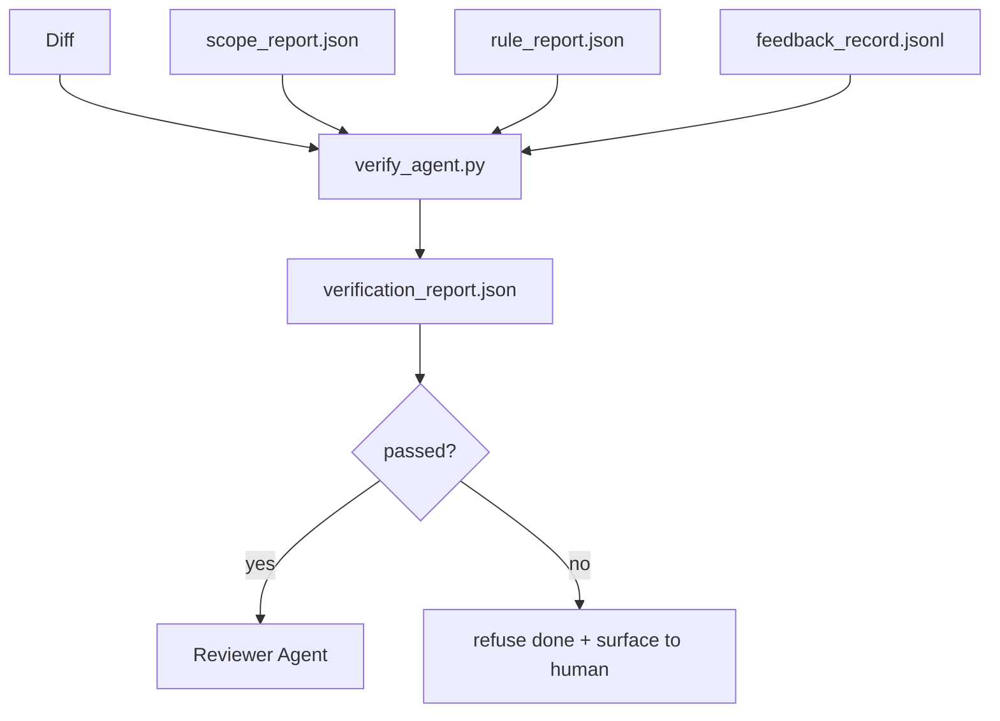

# 验证门

> 智能体不能给自己标记任务完成。一个验证门读取范围合约、反馈日志、规则报告和差异，并回答一个单一问题：这个任务真的完成了吗？如果门说“否”，那么无论聊天记录如何，任务都未完成。

**类型：** 构建  
**语言：** Python（标准库）  
**前置条件：** 第14阶段·33（规则），第14阶段·36（范围），第14阶段·37（反馈）  
**时长：** 约55分钟

## 学习目标

- 将验证门定义为工作台工件上的确定性函数。
- 将规则报告、范围报告、反馈记录和差异合并为一个最终判决。
- 生成一个审查智能体和CI都能读取的 `verification_report.json`。
- 拒绝推进存在任何阻止级（block-severity）失败的任务，绝无例外。

## 问题

智能体太容易宣称成功。三种失败形态占主导：

- “看起来不错。”模型读取了自己的差异并认定它是正确的。
- “测试通过了。”说得自信满满，但没有测试实际运行的记录。
- “验收标准已满足。”验收标准被解释得足够宽松，以至于意味着“任何与完成相似的东西”。

工作台的解决方案是一个单一的验证门，它读取智能体已产生的工件并作出判断。这个门是确定性的。这个门受版本控制。这个门被接入CI。智能体无法贿赂它。

## 概念



### 门检查的内容

| 检查项 | 来源工件 | 严重级别 |
|--------|----------|----------|
| 所有验收命令已运行 | `feedback_record.jsonl` | 阻止 |
| 所有验收命令以零退出 | `feedback_record.jsonl` | 阻止 |
| 范围检查无禁止写入 | `scope_report.json` | 阻止 |
| 范围检查无超出范围写入 | `scope_report.json` | 阻止或警告 |
| 所有阻止级规则通过 | `rule_report.json` | 阻止 |
| 反馈中无 `null` 退出码 | `feedback_record.jsonl` | 阻止 |
| 触碰文件匹配 `scope.allowed_files` | 两者 | 警告 |

一个`警告`发现会标注判决；一个`阻止`发现会阻止 `passed: true`。

### 确定性，而非概率性

门必须为同一工件集每次产生相同的判决。不允许LLM裁判。LLM裁判属于审查器侧（第14阶段·39），其目标是定性评估，而非状态判定。

### 单一报告，单一路径

门为每次任务关闭生成一个 `verification_report.json`，写入 `outputs/verification/<task_id>.json`。CI也使用同一路径。多个门使用不同路径会分割真相源。

### 拒绝无例外

阻止级发现不能被智能体覆盖。它们只能被人类覆盖，并记录 `override_reason` 和 `overridden_by` 用户ID。覆盖是一个签名变更，而非智能体决策。

## 构建它

`code/main.py` 实现：

- 每个输入工件的加载器，都在本地存根，以使课程自包含。
- 一个 `verify(task_id, artifacts) -> VerdictReport` 纯函数。
- 一个打印器，显示每项检查的结果以及最终通过/失败。
- 一个包含三个任务场景的演示：干净通过、范围蔓延、缺少验收。

运行它：

```
python3 code/main.py
```

输出：三个判决报告，每个都保存在脚本旁边。

## 生产模式示例

四种模式将门从“另一个lint作业”提升为“决定性优势”。

**纵深防御，而非单一门。** 预提交钩子 → CI状态检查 → 预工具授权钩子 → 预合并门。每一层都是确定性的，因此一层的失败会被下一层捕获。microservices.io 2026年3月的操作手册明确指出：预提交钩子是不可绕过的，因为与模型侧技能不同，它不依赖智能体遵循指令。验证门位于CI/预合并层。

**通过确定性检查防御，模型裁判仅用于细微之处。** Anthropic 2026年混合规范配对：可验证奖励（单元测试、模式检查、退出码）回答“代码解决了问题吗？”——LLM评分标准回答“代码可读、安全、符合风格吗？”门运行第一类；审查器（第14阶段·39）运行第二类。将它们混合会混淆信号。

**签名覆盖日志，而非Slack讨论。** 每次覆盖在 `outputs/verification/overrides.jsonl` 中输出一行，包含：时间戳、发现代码、原因、签名用户、当前HEAD提交。运行时会拒绝任何缺少签名的覆盖；审计轨迹由Git追踪。这是一个覆盖政策与覆盖形式之间的界线。

**覆盖率底线作为一等检查。** 一个 `coverage_report.json` 为 `coverage_floor` 检查（默认80%）提供输入。如果测得的覆盖率低于底线或低于上一次合并的底线超过1个百分点，门会失败。没有这个检查，智能体会悄悄删除失败的测试，而验证报告仍然保持绿色。

**`--strict` 模式将警告提升为阻止。** 对于发布分支、阻塞发布的PR或事后问题排查，`--strict` 使每个警告都成为硬失败。该标志按分支选择加入；不是全局默认值，因为事事严格会侵蚀日常流程。

## 使用它

生产模式：

- **CI步骤。** 一个 `verify_agent` 作业针对智能体的最终工件运行门。合并保护在没有 `passed: true` 的情况下拒绝合并。
- **预交接钩子。** 智能体运行环境在生成交接文档之前调用门。没有绿色判决，就不进行交接。
- **手动问题排查。** 当智能体声称成功而人类怀疑时，操作员读取报告。

门是工作台流程中的决定性优势。所有其他表面都在它的上游。

## 交付它

`outputs/skill-verification-gate.md` 将门接入特定项目：哪些验收命令为其提供输入，哪些规则是阻止级，哪些超出范围的写入被容忍，以及覆盖审计日志如何存储。

## 练习

1. 添加一个 `coverage_floor` 检查：测试命令必须生成至少80%的覆盖率报告。决定哪个工件承载这个底线。
2. 支持 `--strict` 模式，将每个 `warn` 提升为 `block`。记录哪些情况下严格模式是合适的默认值。
3. 让门除了JSON之外还生成Markdown摘要。论证哪些字段应属于摘要。
4. 添加一个 `time_since_last_human_touch` 检查：任何在人类击键后60秒内编辑的文件都免除超出范围标记。
5. 在你的产品中对一个真实的智能体差异运行门。有多少发现是真实的，多少是噪音？门需要在哪些方面成长？

## 关键术语

| 术语 | 人们通常说的 | 实际含义 |
|------|--------------|----------|
| 验证门 | "阻止事情的那个检查" | 对工作台工件进行确定性函数计算，产生通过/失败判决 |
| 阻止级严重性 | "硬失败" | 一种发现，阻止 `passed: true`，需要签名覆盖 |
| 覆盖日志 | "为什么我们放行了它" | 包含原因和用户ID的签名条目，由审查进行审计 |
| 验收命令 | "证据" | 一个shell命令，其零退出就是`完成`的含义 |
| 单一报告路径 | "真相源" | `outputs/verification/<task_id>.json`，同时被CI和人类使用 |

## 延伸阅读

- [Anthropic, Harness design for long-running application development](https://www.anthropic.com/engineering/harness-design-long-running-apps)
- [OpenAI Agents SDK guardrails](https://platform.openai.com/docs/guides/agents-sdk/guardrails)
- [microservices.io, GenAI dev platform: guardrails](https://microservices.io/post/architecture/2026/03/09/genai-development-platform-part-1-development-guardrails.html) — 预提交与CI之间的纵深防御
- [ICMD, The 2026 Playbook for Agentic AI Ops](https://icmd.app/article/the-2026-playbook-for-agentic-ai-ops-guardrails-costs-and-reliability-at-scale-1776661990431) — 审批门阶梯（草稿 → 审批 → 阈值下自动）
- [Type-Checked Compliance: Deterministic Guardrails (arXiv 2604.01483)](https://arxiv.org/pdf/2604.01483) — Lean 4作为确定性门的理论上限
- [logi-cmd/agent-guardrails — merge gate spec](https://github.com/logi-cmd/agent-guardrails) — 范围+变异测试门
- [Guardrails AI x MLflow](https://guardrailsai.com/blog/guardrails-mlflow) — 作为CI评分器的确定性验证器
- [Akira, Real-Time Guardrails for Agentic Systems](https://www.akira.ai/blog/real-time-guardrails-agentic-systems) — 工具前/工具后门
- 第14阶段·27 — 提示注入防御（门的对抗性配对）
- 第14阶段·36 — 此门所执行的范围合约
- 第14阶段·37 — 此门所评分的反馈日志
- 第14阶段·39 — 门所交接给的审查智能体
