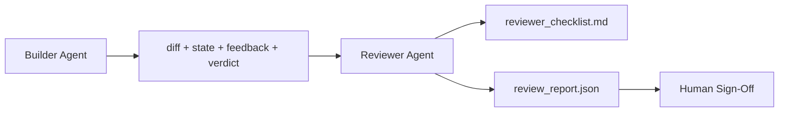

# 评审智能体：将构建者与评审者分离

> 编写代码的智能体不能对其评分。评审者是第二个循环，具有不同的系统提示、不同的目标，以及对构建者所生成内容只读的访问权限。构建者与评审者之间的差距正是可靠性之所在。

**类型：** 构建  
**语言：** Python（标准库）  
**前置条件：** 阶段 14 · 38（验证关卡）  
**时间：** ~55 分钟  

## 学习目标

- 阐述为何同一智能体无法可靠地评审自己的成果。
- 构建一个消费构建者产出并输出结构化评审报告的评审智能体循环。
- 编写一个评测量化维度的评审者准则，而非凭感觉。
- 将评审者接入工作台，使人机评审步骤从真实的产出物开始。

## 问题

你让智能体修复一个 bug。它编辑了四个文件，运行了测试，然后报告完成。验证关卡（阶段 14 · 38）确认验收已执行且范围未变。关卡通报表显示 `passed: true`。你合并了。两天后你发现这个修复只解决了 bug 的一半。

验收是必要的，但并不充分。评审者会提出验收无法提出的问题：这次的改动是否解决了正确的问题？它是否在未标注的情况下扩大了范围？它是否记录了本应被质疑的假设？它是否让工作台的状态能够被下一次会话顺利接手？

## 概念



### 评审者准则

五个维度，每个维度 0–2 分。

| 维度 | 问题 |
|------|------|
| 问题匹配度 | 改动是否解决了任务所陈述的问题，而非某一邻近问题？ |
| 范围纪律 | 编辑是否局限于合约内，还是合约被刻意扩大了？ |
| 假设 | 所有隐藏的假设是否都已记录在可供审查的地方？ |
| 验证质量 | 验收命令是否确实证明了目标，还是只证明了一个较弱版本？ |
| 交接准备度 | 下一次会话能否从当前状态顺利接手？ |

总分 10 分。低于 7 分为软失败；低于 5 分为硬失败。

### 评审者是一个独立的角色，而非独立的模型

你可以用与构建者相同的模型来运行评审者。关键在于角色分离：不同的系统提示、不同的输入、对差异没有写入权限。姿态的改变就是信号的改变。

### 评审者不能编辑差异

评审者读取差异、状态、反馈、判定。它撰写一份报告。它不修补差异。如果报告说“修复这个”，则由下一次构建者轮次进行修复；评审者则回到评审状态。混合角色会破坏这个差距。

### 评审者准则与验证关卡

验证关卡（阶段 14 · 38）检查确定性事实：验收是否运行、规则是否通过、范围是否保持不变。评审者做出定性判断：这次工作是否合适、是否已记录、交接是否可用。两者都是必需的。

## 构建它

`code/main.py` 实现：

- 一个 `ReviewerInputs` 数据类，打包评审者读取的产出物。
- 按维度划分的准则评分器，每个维度一个函数。每个函数对于本课而言是确定性的且为存根级别；真实实现会调用 LLM。
- 一个 `review_report.json` 写入器，包含五个分数、总分以及一个判定（`pass`、`soft_fail`、`hard_fail`）。
- 两个演示案例：一个干净的改动和一个“测试正确但问题错误”的改动。

运行它：

```
python3 code/main.py
```

输出：两个评审报告写入磁盘，以及一个维度得分的控制台表格。

## 实战中的生产模式

事实依据：Cloudflare 2026 年 4 月的 AI 代码评审系统在 30 天内在 5,169 个代码仓库的 48,095 个合并请求上运行了 131,246 次评审运行。中位数评审完成时间为 3 分 39 秒。多达七名专家评审者（安全、性能、代码质量、文档、发布管理、合规、工程编码规范）在评审协调器下并行运行，协调器负责去重并判断严重程度。顶级模型仅保留给协调器使用；专家评审者运行在更便宜的模型层级上。

四种模式使其能够大规模工作。

**专家池，而非一个大的评审者。** 一个带有 5 维度准则的评审者适用于单人仓库。一旦代码库包含安全关键、性能关键和文档等不同层面，就应拆分为提示更小的专家评审者。协调器负责去重；专家评审者从不运行完整准则。模型层级分离自然产生：廉价专家，昂贵协调器。

**偏见缓解作为设计要求，而非优化事项。** LLM 评审者表现出四种可靠的偏见（Adnan Masood，2026 年 4 月）：位置偏见（GPT-4 在 (A,B) 和 (B,A) 排序上约 40% 不一致）、冗长偏见（约 15% 的分数膨胀偏向于更长的输出）、自我偏好（评审者偏好来自同一模型家族的输出）、权威性（评审者高估对已知作者的引用）。缓解措施：评估两种顺序，只计算一致的胜出；使用明确奖励简洁性的 1-4 分制；轮换不同模型家族的评审者；在评分前去掉作者姓名。

**校准集，而非直觉。** 一组 10–20 个已知正确判定的历史任务。每次提示变更后都用它运行评审者。如果与历史记录的一致性低于 80%，则准则需要修订后才能发布。这正是每个团队最终都会重新发现的方法；最好从一开始就采用。

**与关卡结合的混合规范。** 验证关卡（阶段 14 · 38）处理确定性检查（验收是否运行、测试是否通过、范围是否保持不变）。评审者处理语义检查（工作是否合适、假设是否记录、交接是否可用）。Anthropic 2026 年的指南明确说明了这种分离：不要要求评审者重复关卡已经证明的事情。

## 使用它

生产模式：

- **Claude Code 子智能体。** 评审者子智能体在构建者完成一个任务后运行。它会在 PR 上发布一条带有准则分数的评论。
- **OpenAI Agents SDK 交接。** 构建者在任务完成时将控制权交给评审者。评审者可以带着一份发现列表交回，或者交给人工。
- **双模型配对。** 构建者运行在更快更便宜的模型上。评审者运行在更强的模型上，上下文更小，专注于判断。

评审者就是工作台在人类无法亲自评审每一个变更时拥有的第二双眼睛。

## 交付它

`outputs/skill-reviewer-agent.md` 生成为一个项目特定的评审者准则、一个与构建者产出物相连的评审者智能体存根，以及与验证关卡的集成，使得人工评审从一份写好的报告开始，而非空白页面。

## 练习

1. 为你的产品领域添加第六个维度。论证为何它不能被现有的五个维度所吸收。
2. 用两种不同的系统提示（简洁版、冗长版）运行评审者。哪一种产生的报告更可能被人阅读？
3. 为每个维度增加一个 `confidence` 字段。当最低维度的置信度低于 0.6 时，拒绝发布报告。
4. 构建一个校准集：10 个具有已知正确判定的历史任务关闭记录。用评审者进行评审。它在哪些地方与历史记录不一致？
5. 增加一个“请求更多证据”的能力：评审者可以在评分前要求构建者进行特定的测试运行。合理的退避策略是什么，以避免无限循环？

## 关键术语

| 术语 | 人们常说的 | 实际含义 |
|------|------------|----------|
| 评审者准则 | “清单” | 五个维度 0–2 分评分，每个维度附有书面问题 |
| 软失败 | “需要修订” | 总分低于 7；构建者需要根据发现进行修复 |
| 硬失败 | “拒绝” | 总分低于 5 或任一维度为 0；停止并上报给人工 |
| 角色分离 | “不同的提示” | 同一模型可以担任两种角色；关键是输入和姿态的不同 |
| 置信度下限 | “不要输出低信号报告” | 当准则不确定时拒绝发出判定 |

## 扩展阅读

- [OpenAI Agents SDK handoffs](https://platform.openai.com/docs/guides/agents-sdk/handoffs)
- [Anthropic Claude Code subagents](https://docs.anthropic.com/en/docs/agents-and-tools/claude-code/sub-agents)
- [Cloudflare, Orchestrating AI Code Review at Scale](https://blog.cloudflare.com/ai-code-review/) — 7 专家 + 协调器架构，13.1 万次运行 / 30 天
- [Agent-as-a-Judge: Evaluating Agents with Agents (OpenReview / ICLR)](https://openreview.net/forum?id=DeVm3YUnpj) — DevAI 基准，366 个层次化解决方案需求
- [Adnan Masood, Rubric-Based Evaluations and LLM-as-a-Judge: Methodologies, Biases, Empirical Validation](https://medium.com/@adnanmasood/rubric-based-evals-llm-as-a-judge-methodologies-and-empirical-validation-in-domain-context-71936b989e80) — 四种偏见及缓解措施
- [MLflow, LLM-as-a-Judge Evaluation](https://mlflow.org/llm-as-a-judge) — 分离构建者/评估者的生产工具
- [LangChain, How to Calibrate LLM-as-a-Judge with Human Corrections](https://www.langchain.com/articles/llm-as-a-judge) — 校准集工作流
- [Evidently AI, LLM-as-a-judge: a complete guide](https://www.evidentlyai.com/llm-guide/llm-as-a-judge)
- [Arize, LLM as a Judge — Primer and Pre-Built Evaluators](https://arize.com/llm-as-a-judge/)
- 阶段 14 · 05 — 自我优化与 CRITIC（单智能体自我评审基线）
- 阶段 14 · 30 — 基于评估的智能体开发（校准集生成器）
- 阶段 14 · 38 — 评审者读取的验证关卡
- 阶段 14 · 40 — 评审者报告输入的手续包
