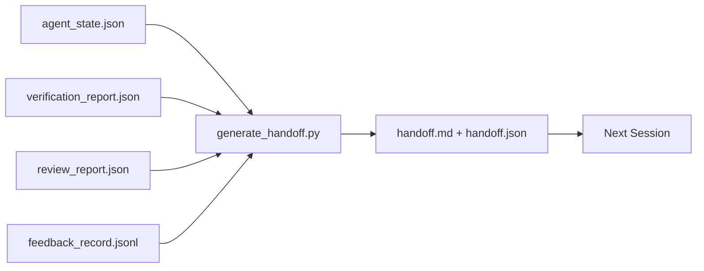

# 多会话交接

> 会话即将结束，但工作并未结束。交接包是将“代理工作了一个小时”转化为“下一个会话在第一分钟就高效产出”的关键产物。请有意识地构建它，而不是事后才想起。

**类型：** 构建  
**语言：** Python（stdlib）  
**前置条件：** 阶段 14 · 34（仓库记忆），阶段 14 · 38（验证），阶段 14 · 39（审阅者）  
**时间：** ~50 分钟  

## 学习目标

- 识别每个交接包所需的七个字段。
- 无需手动编写散文，即可从工作台制品生成交接包。
- 将大型反馈日志裁剪为适合交接包的摘要。
- 确定下一个会话的第一个操作。

## 问题

会话结束了。代理说：“太好了，我们取得了进展。”下一个会话开启。下一个代理问：“我们上次停在哪里？”上一个代理的回答消失了。下一个代理重新发现、重新运行相同的命令、重新向人类提出相同的问题，然后花费 30 分钟来恢复上一会话的最后 30 秒。

糟糕的交接的成本在任务的整个生命周期中的每个会话都会付出。修复方法是在会话结束时自动生成一个包：做了什么、为什么做、尝试了什么、失败了什么、还剩什么、下次首先做什么。

## 概念



### 每个交接包携带的七个字段

| 字段 | 它回答的问题 |
|------|----------------|
| `summary` | 已完成内容的一段概述 |
| `changed_files` | 差异概览 |
| `commands_run` | 实际执行的命令 |
| `failed_attempts` | 尝试了什么以及为什么失败 |
| `open_risks` | 可能在下个会话中造成问题的事项及其严重程度 |
| `next_action` | 下个会话要采取的第一个具体步骤 |
| `verdict_pointer` | 验证与审阅报告的路径 |

`next_action` 字段是承载关键作用的字段。一个交接包如果缺乏 `next_action`，那就只是一份状态报告，而非有效的交接。

### 交接包是生成的，而非手写的

手写的交接包在忙碌的日子里很容易被跳过。生成器读取工作台制品并输出包。代理的工作是让工作台处于生成器可以汇总的状态，而不是去编写摘要。

### 两种形式：人类可读和机器可读

`handoff.md` 是人类阅读的。`handoff.json` 是下一个代理加载的。两者都来自相同的源制品。如果它们不一致，以 JSON 为准。

### 反馈日志裁剪

完整的 `feedback_record.jsonl` 可能有数百条记录。交接包只携带最后 K 条记录以及所有非零退出的条目。下一个会话如果需要可以加载完整日志，但包保持小巧。

## 构建它

`code/main.py` 实现：

- 一个加载器，将状态、裁决、审阅和反馈整合到单个 `WorkbenchSnapshot` 中。
- 一个 `generate_handoff(snapshot) -> (markdown, payload)` 函数。
- 一个过滤器，选取最后 K 条反馈记录以及所有非零退出的条目。
- 一个演示运行，在脚本旁边写入 `handoff.md` 和 `handoff.json`。

运行它：

```
python3 code/main.py
```

输出：打印的交接内容，以及磁盘上的两个文件。

## 生产环境中的模式

Codex CLI、Claude Code 和 OpenCode 各自提供了不同的压缩方案；结构化的交接包位于这三者的上层。

**压缩策略各不相同，但交接包模式是统一的。** Codex CLI 的 POST /v1/responses/compact 是服务端不透明的 AES 数据块（适用于 OpenAI 模型的快速路径）；备用方案是本地“交接摘要”，作为 `_summary` 用户角色消息追加。Claude Code 在上下文达到 95% 时执行五阶段渐进式压缩。OpenCode 执行基于时间戳的消息隐藏，加上 5 个标题的 LLM 摘要。三种不同的机制，相同的需求：将压缩后可存活的内容序列化为可移植的制品。交接包正是这种制品。

**新会话的交接不是压缩。** 压缩延长会话；交接则干净地结束一个会话并启动下一个。Hermes Issue #20372（2026 年 4 月）的框架是正确的：当就地压缩开始降质时，代理应编写一个紧凑的交接，结束会话，并在全新的上下文中继续。交接包使这种过渡成本低廉。错误做法是持续压缩直到质量崩溃；正确做法是预留空间，及早进行干净的交接。

**每个分支和主题只有一个活跃的交接。** 多代理协调中的失效交接比模型输出错误更致命。始终包含 `branch`、`last_known_good_commit` 和 `status`（`active | superseded | archived`）。过时的交接被归档；只有活跃的交接指导下一个会话。这是“交接即笔记”与“交接即状态”的区别。

**在上下文达到 50-75% 时结束，而不是到极限。** 手写交接模式手册（CLAUDE.md + HANDOVER.md）报告的最佳实践是：在上下文预算达到 50-75% 时结束会话，而不是 95%。在压缩产物污染源状态之前，交接包生成器能干净地运行。上下文完好时编写成本低；当模型已经开始丢失位置时，编写成本高昂。

## 使用它

生产模式：

- **会话结束钩子。** 运行时在用户关闭聊天时触发生成器。交接包放入 `outputs/handoff/<session_id>/`。
- **PR 模板。** 生成器的 Markdown 也适合作为 PR 正文。审阅者无需打开其他五个文件即可阅读。
- **跨代理交接。** 用一个产品（Claude Code）构建，用另一个（Codex）继续。交接包是通用语言。

交接包小、规范、生成成本低。成本节约随每个会话而累积。

## 交付它

`outputs/skill-handoff-generator.md` 生成一个生成器，该生成器针对项目的制品路径定制、一个运行它的会话结束钩子，以及一个下一个代理在启动时读取的 `handoff.json` 模式。

## 练习

1. 添加一个 `assumptions_to_validate` 字段，该字段展示所有构建者记录但审阅者未给出高于 1 分的假设。
2. 针对失败的运行和成功的运行，以不同的方式裁剪反馈摘要。为这种不对称进行辩护。
3. 包含一个“向人类提出的问题”列表。问题进入交接包与进入聊天消息的门槛是什么？
4. 使生成器具有幂等性：运行两次产生相同的包。为了做到这一点，需要哪些东西保持稳定？
5. 添加一个“下一个会话前置条件”部分，列出下一个会话在行动之前必须加载的确切制品。

## 关键术语

| 术语 | 人们通常说的 | 实际含义 |
|------|--------------|----------|
| 交接包 | “会话摘要” | 生成的制品，包含七个字段，同时提供 Markdown 和 JSON 格式 |
| 下一步行动 | “首先做什么” | 启动下一个会话的一个具体步骤 |
| 反馈裁剪 | “日志摘要” | 最后 K 条记录加上所有非零退出的条目 |
| 状态报告 | “我们做了什么” | 缺少 `next_action` 的文档；有用，但不算交接 |
| 裁决指针 | “收据” | 验证与审阅报告的路径，用于可追溯性 |

## 延伸阅读

- [Anthropic, Effective harnesses for long-running agents](https://www.anthropic.com/engineering/effective-harnesses-for-long-running-agents)
- [OpenAI Agents SDK handoffs](https://platform.openai.com/docs/guides/agents-sdk/handoffs)
- [Codex Blog, Codex CLI Context Compaction: Architecture, Configuration, Managing Long Sessions](https://codex.danielvaughan.com/2026/03/31/codex-cli-context-compaction-architecture/) — POST /v1/responses/compact 与本地备用方案
- [Justin3go, Shedding Heavy Memories: Context Compaction in Codex, Claude Code, OpenCode](https://justin3go.com/en/posts/2026/04/09-context-compaction-in-codex-claude-code-and-opencode) — 三家供应商压缩方案对比
- [JD Hodges, Claude Handoff Prompt: How to Keep Context Across Sessions (2026)](https://www.jdhodges.com/blog/ai-session-handoffs-keep-context-across-conversations/) — CLAUDE.md + HANDOVER.md，50-75% 上下文预算
- [Mervin Praison, Managing Handoffs in Multi-Agent Coding Sessions: Fresh Context Without Losing Continuity](https://mer.vin/2026/04/managing-handoffs-in-multi-agent-coding-sessions-fresh-context-without-losing-continuity/) — 分布式系统框架
- [Hermes Issue #20372 — automatic fresh-session handoff when compression becomes risky](https://github.com/NousResearch/hermes-agent/issues/20372)
- [Hermes Issue #499 — Context Compaction Quality Overhaul](https://github.com/NousResearch/hermes-agent/issues/499) — Codex CLI 中面向交接的提示
- [Microsoft Agent Framework, Compaction](https://learn.microsoft.com/en-us/agent-framework/agents/conversations/compaction)
- [OpenCode, Context Management and Compaction](https://deepwiki.com/sst/opencode/2.4-context-management-and-compaction)
- [LangChain, Context Engineering for Agents](https://www.langchain.com/blog/context-engineering-for-agents)
- 阶段 14 · 34 — 生成器读取的状态文件
- 阶段 14 · 38 — 交接包指向的验证裁决
- 阶段 14 · 39 — 打包进交接包的审阅者报告
