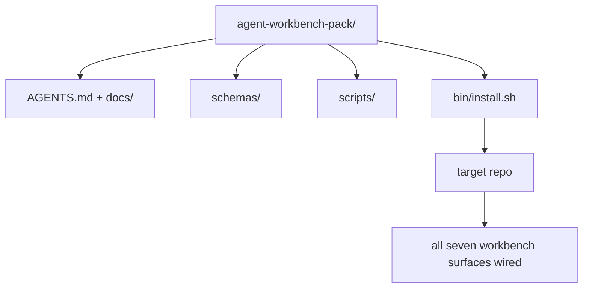

# 顶石项目：发布一个可复用的智能体工作台包

> 迷你专题的终点是一个可以直接放入任何仓库的包。将十一个课时的表面压缩成一个目录，只需 `cp -r`，第二天早上就能拥有一个可靠运行的智能体。这个顶石项目是本课程的核心产出物。

**类型：** 构建
**语言：** Python（标准库）
**前置条件：** 第14·31至14·41阶段
**时长：** ~75分钟

## 学习目标

- 将七个工作台表面打包成一个可直接嵌入的目录。
- 固定模式、脚本和模板，使新仓库获得一个已知良好的基线。
- 添加一个安装脚本，可幂等地部署该包。
- 决定哪些内容保留在包内、哪些留在包外，并为每个决策提供理由。

## 问题描述

一个存在于 Google 文档、聊天记录和三个半遗忘脚本中的工作台，每个季度都要重建一次。解决方案是一个版本化的包：一个包含表面、模式、脚本和单命令安装器的仓库或目录。

完成本节课后，你将拥有一个磁盘上的 `outputs/agent-workbench-pack/` 和一个 `bin/install.sh`，能够将其部署到任何目标仓库中。

## 概念



### 包的布局

```
outputs/agent-workbench-pack/
├── AGENTS.md
├── docs/
│   ├── agent-rules.md
│   ├── reliability-policy.md
│   ├── handoff-protocol.md
│   └── reviewer-rubric.md
├── schemas/
│   ├── agent_state.schema.json
│   ├── task_board.schema.json
│   └── scope_contract.schema.json
├── scripts/
│   ├── init_agent.py
│   ├── run_with_feedback.py
│   ├── verify_agent.py
│   └── generate_handoff.py
├── bin/
│   └── install.sh
└── README.md
```

### 保留什么，排除什么

保留：

- 表面模式。它们是契约。
- 上述四个脚本。它们是运行时。
- 四个文档。它们是规则和评估标准。

排除：

- 项目特定的任务。任务属于目标仓库的任务板，不在包内。
- 供应商 SDK 调用。该包与框架无关。
- 入门引导文案。包应放在团队现有入门引导旁边，而非插入其中。

### 安装器

一个简短的 `bin/install.sh`（或 `bin/install.py`）：

1. 如果目标仓库已存在该包且未使用 `--force`，则拒绝安装。
2. 将包复制到目标仓库。
3. 如果存在 `.github/workflows/`，则配置 CI。
4. 打印下一步操作：填写任务板、设置验收命令、运行初始化脚本。

### 版本控制

包包含一个 `VERSION` 文件。需要迁移的模式更新和脚本更改提升主版本号。仅文档更改提升补丁版本号。目标仓库的 `agent_state.json` 记录它是基于哪个包版本初始化的。

## 构建它

`code/main.py` 将包组装到 `outputs/agent-workbench-pack/` 中（位于课程旁边），并从本迷你专题之前课程的模式和脚本以及你已经编写的文档中获取种子内容。

运行：

```
python3 code/main.py
```

该脚本复制并固定表面，编写 README，打印包树，并以零状态退出。重复运行是幂等的。

## 生产环境中的模式

一个包只有在能够经受分叉、更新和不友好的上游时才有价值。四种模式可以做到这一点。

**`VERSION` 是契约，而非营销。** 主版本提升需要状态迁移。次版本提升需要重新运行检查器。补丁版本提升仅涉及文档。安装器每次安装时都会在目标仓库中写入 `.workbench-version`；`lint_pack.py` 在目标仓库的锁定版本与包的 `VERSION` 不一致时会拒绝发布。这就是 `npm`、`Cargo` 和 `pyproject.toml` 能在10年变更中存活的方式；智能体并不能改变这一规则。

**跨工具分发的单一来源。** Nx 提供了一个 `nx ai-setup` 命令，从单个配置中部署 `AGENTS.md`、`CLAUDE.md`、`.cursor/rules/`、`.github/copilot-instructions.md` 和一个 MCP 服务器。包也应如此；安装器会创建符号链接（`ln -s AGENTS.md CLAUDE.md`），使单一来源辐射到所有编码智能体。为支持某个工具而分叉包是一种失败模式。

**拒绝处理非平凡状态的 `uninstall.sh`。** 卸载包时不得删除用户的 `agent_state.json`、`task_board.json` 或 `outputs/`。卸载器会删除模式、脚本、文档和 `AGENTS.md`（提供 `--keep-agents-md` 选项），并在状态文件有未提交更改时拒绝继续。状态属于用户；包不拥有它。

**技能即发布。SkillKit 风格的分发。** 包作为 SkillKit 技能发布：`skillkit install agent-workbench-pack` 从单一来源将其部署到 32 个 AI 智能体。包仓库是真相来源；SkillKit 是分发渠道。供应商锁定被打破；七个表面保持不变。

## 使用它

包的三种部署方式：

- **作为目录直接放入仓库。** `cp -r outputs/agent-workbench-pack /path/to/repo`。
- **作为公开模板仓库。** 分叉并自定义，通过 `VERSION` 控制漂移。
- **作为 SkillKit 技能。** 集成到你的智能体产品中，单条命令即可部署。

包是配方。每次安装都是一次服务。

## 发布它

`outputs/skill-workbench-pack.md` 生成一个针对项目调整的包：规则根据团队历史优化，范围通配符与仓库匹配，评估标准维度扩展了一个领域特定的条目。

## 练习

1. 决定哪个可选的第五个文档值得提升到标准包中。为你的选择提供理由。
2. 用 Python 重写安装器，增加 `--dry-run` 标志。比较与 bash 版本的易用性。
3. 添加一个 `bin/uninstall.sh`，能够安全移除包，并在状态文件存在非平凡历史时拒绝执行。什么算作非平凡？
4. 添加一个 `lint_pack.py`，当包与 `VERSION` 发生漂移时失败。将其集成到包自身仓库的 CI 中。
5. 编写从手工制作的工作台迁移到本包的运行手册。什么操作顺序能够最小化停机时间？

## 关键术语

| 术语 | 人们通常怎么说 | 实际含义 |
|------|----------------|----------|
| 工作台包 | “入门套件” | 一个包含所有七个表面的版本化目录 |
| 安装器 | “设置脚本” | `bin/install.sh`，幂等地部署包 |
| 包版本 | “VERSION” | 模式/脚本变更提升主版本，仅文档变更提升补丁版本 |
| 即插即用包 | “cp -r 即可用” | 包无需按仓库定制即可在第一天工作 |
| 可分叉模板 | “GitHub 模板” | 公开仓库，GitHub 的“使用此模板”功能可从中克隆 |

## 延伸阅读

- 第14·31至14·41阶段——本包所捆绑的所有表面
- [SkillKit](https://github.com/rohitg00/skillkit)——将此技能安装到 32 个 AI 智能体
- [Nx 博客：教你的 AI 智能体如何在单体仓库中工作](https://nx.dev/blog/nx-ai-agent-skills)——跨六个工具的单一来源生成器
- [agents.md——开放规范](https://agents.md/)——你的包路由器必须实现的内容
- [HKUDS/OpenHarness](https://github.com/HKUDS/OpenHarness)——包等价物的参考实现
- [andrewgarst/agentic_harness](https://github.com/andrewgarst/agentic_harness)——基于 Redis 的参考实现，包含评估套件
- [Augment Code：一份好的 AGENTS.md 就是一次模型升级](https://www.augmentcode.com/blog/how-to-write-good-agents-dot-md-files)——包文档质量基准
- [Anthropic：长期运行智能体的有效框架](https://www.anthropic.com/engineering/effective-harnesses-for-long-running-agents)
- [Anthropic：长期运行应用开发的框架设计](https://www.anthropic.com/engineering/harness-design-long-running-apps)
- 第14·30阶段——基于评估的智能体开发，使用包的验证门
- 第14·41阶段——本包改进前后的基准对比
